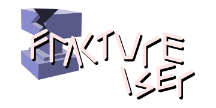

    

## Ne?
`fractureiser`, CurseForge'a yüklenen birkaç Minecraft projesinde ve CraftBukkit'in geliştirici web sitesinde bulunan bir [Virüs](https://en.wikipedia.org/wiki/Computer_virus)'tür. Kötü amaçlı yazılım, birden fazla moda gömülüdür ve bazıları son derece popüler mod paketlerine eklenmiştir. Bu kötü amaçlı yazılımın yalnızca Windows ve Linux sistemlerine hedeflendiği bilinmektedir.

Kontrolsüz bırakılırsa, fractureiser makineniz için **SON DERECE TEHLİKELİ** olabilir. Kendinizi güvende tutmak için bu belgeyi okuyun.

En dikkat çeken kötü amaçlı dosyaları yükleyen CurseForge hesabının adı "fractureiser" olduğu için bu kötü amaçlı yazılıma "fractureiser" adını verdik.

## Bilmeniz Gerekenler

### [Modlu Oyuncular BURAYA TIKLAYIN](docs/users_tr.md)

Sadece bir mod oyuncusuysanız ve bir geliştirici değilseniz, yukarıdaki bağlantı işinizi görecektir. Bu bağlantıda kötü amaçlı yazılımın etkileri, sahip olup olmadığınızı kontrol etmek ve nasıl kaldırılacağı hakkında yüzey seviyesinde bilgi, ve bir SSS bulunmaktadır.

Daha derinlemesine inmek isteyen herkes ayrıca şu sayfalara da bakabilir:
* [Etkinlik Zaman Çizelgesi](docs/timeline_tr.md)
* [Teknik Ayrıntılar](docs/tech_tr.md)

### Hiçbir Minecraft modu kullanmadım

Enfekte değilsiniz.

## Şu Anki Soruşturma Durumu
fractureiser'ın 0'dan 3'e kadar olan aşamalarının nasıl çalıştığı konusunda iyi bir fikrimiz var. Belirli bilinmeyenler olsa da, saldırı sunucuları çevrimdışı ve bilgimize göre *yeni* enfeksiyonlar mümkün değil. Eski enfeksiyonlar hala aktif olabilir.

Şu anda kullanıcı odaklı belgeleri geliştirmek üzerinde çalışıyoruz, lütfen kaynaklar için oraya bakın.

## Takip Toplantısı
2023-06-08 tarihinde fractureiser Önleme Ekibi, bu ölçekteki gelecekteki sorunlar için önleyici tedbirler ve çözümler konusunda topluluğun dikkate değer üyeleriyle bir toplantı gerçekleştirdi.
Etkinliğin gündemi ve tutanakları için [bu sayfaya](https://github.com/fractureiser-investigation/fractureiser/blob/main/docs/2023-06-08-meeting_tr.md) bakın.

## Ek Bilgiler

Bu kötü amaçlı yazılımla ilgili dosyalarınız varsa, lütfen bunları https://wormhole.app adresine yükleyin ve URL'yi fractureiser.investigation@opayq.com adresine e-posta olarak gönderin. Bu gelen kutusu unascribed tarafından kontrol edilmektedir ve oraya gönderilen her şey ekibin geri kalanıyla paylaşılacaktır. Genel olarak iletişim kurmanız gerekiyorsa, lütfen jaskarth4@gmail.com adresine posta gönderin.

Bu belgenin parçalarını başka bir yere kopyalarsanız, lütfen en üstte bu [GitHub Deposu](https://github.com/fractureiser-investigation/fractureiser)na çarpıcı bir bağlantı yerleştirerek insanların en son güncellemeleri okumasına ve iletişim kurmasına olanak sağlayın.

*Yalnızca* kişisel olarak davet edilmeden katılabileceğiniz tek resmi genel kanal, aynı ekibin bu yazıyı yazan ekip tarafından çalıştırılan [#cfmalware on EsperNet IRC](https://webchat.esper.net/?channels=cfmalware)dir.
**Bir IRC kanalına katılmak IP adresinizi ortaya çıkarır.**

---

\- [fractureiser Önleme Ekibi](docs/credits_tr.md)
