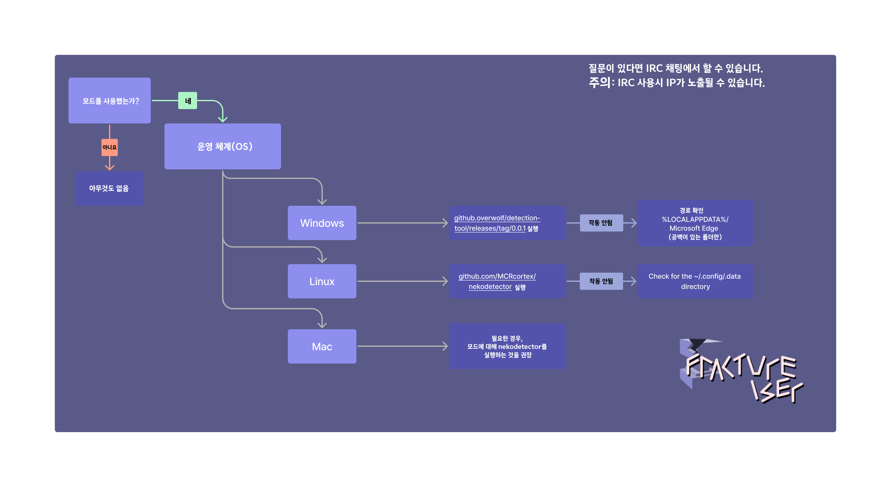
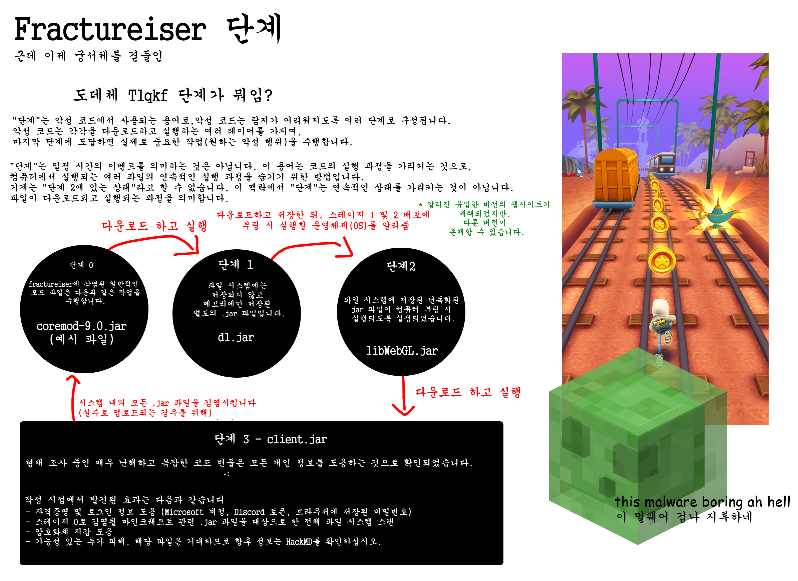
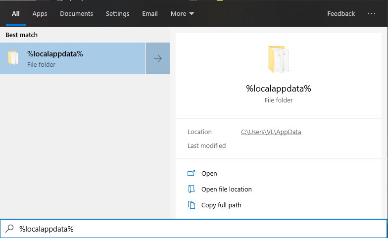

# 모드 플레이어 가이드

**공식 런처**나 Prism과 같은 신뢰할 수 있는 런처를 통해 **바닐라**만 플레이하고, 모드를 한 번도 다뤄보지 않았다면 100% 안전합니다. 현재는 모드를 피하시기 바랍니다.

만약 모드를 사용하는 Minecraft 플레이어라면, fractureiser 악성 코드에 감염되었는지 확인하여 귀하의 컴퓨터와 개인 데이터가 위험에 노출되지 않도록 해야 합니다. 아래의 지침을 따라 확인할 수 있습니다.

### 현재도 계속되고 있나요?

**아니요. 음, 아마도 그럴껍니다.**  
현재로서 우리의 현재 지식으로는 `fractureiser` 바이러스가 현재 공개 모드(팩)에서 완전히 제거된 것으로 여겨집니다.

현재의 권장 사항은 이 페이지에서 stage2 체커를 실행한 플레이어들은 안전하게 게임을 계속할 수 있다는 것입니다. 그러나 CurseForge와 Modrinth에서 모드 업로드가 다시 활성화되었으므로, 이제는 모방하는 악성 코드 작성자들이 새로운 바이러스를 만들 수 있는 가능성이 있습니다.

우리는 이러한 일이 앞으로 발생하지 않도록 관련 당사자들과 접촉 중에 있습니다.

만약 게임을 하고 싶다면, 이 페이지에서 진단 단계와 감염 여부에 따라 해야 할 조치에 대한 후속 섹션을 참고해 주세요.

### 페이지 구조

- [실제로 무슨 일이 일어났는가?](#실제로-무슨-일이-일어났는가)
- [감염되었는지 확인하는 방법](#내가-감염되었는가)
- [감염되었다면, 어떻게 해야 하나요?](#감염되었습니다.-이제-어떻게-해야-하나요)
- [감염되지 않았다면, 어떻게 해야 하나요?](#감염되지않았습니다.-이제-어떻게-해야-하나요)
- [자주 묻는 질문](#자주-묻는-질문)
- [기술적인 자주 묻는 질문](#기술적인-FAQ)

fractureiser에 대한 질문이 있다면 FAQ를 포함한 이 페이지 전체를 읽어주시기 바랍니다. 대부분의 질문들은 여기에 이미 답변되어 있습니다.

## 실제로 무슨 일이 일어났는가?

악성 코드의 작성자가 모드 호스팅 웹사이트인 CurseForge와 플러그인 허브 dev.craftbukkit.org(버킷 소프트웨어 자체가 아님)에 몇 가지 보이기만 하는 악성 모드와 플러그인을 업로드했습니다. 그 후, 유명한 모드 팩 개발자가 이 중 하나의 모드를 다운로드하여 테스트하기 위해 사용했고, 그 결과 이 개발자의 컴퓨터에 악성 코드가 무심코 감염되었습니다. 그리고 이 감염된 파일을 함께 포함하여 CurseForge에 업로드하여 신뢰할 수 있는 파일로 보였지만 악성 코드가 포함된 파일로 업로드되었습니다.

이 과정은 CurseForge와 dev.craftbukkit.org의 사용자로부터 몇 가지 다른 사례들에 대해서도 반복되었으며, 이로 인해 여러 인기 있는 플러그인과 모드의 사본이 감염되었습니다. _4월 중순부터 이미 악성 플러그인과 모드 JAR 파일에 대한 보고가 있습니다._

이와 함께, CurseForge의 인기 있는 콘텐츠 크리에이터 계정에 대해서도 악성 코드 작성자가 무차별 액세스 시도를 시도했습니다. 현재 어떤 계정의 침해가 무차별 액세스 시도 때문인지 아니면 해당 계정 소유자의 트로이 목마에 감염되었기 때문인지 확실하지 않습니다.

이 악성 코드는 여러 "단계"로 구성되어 있으며, 각 단계는 다음 단계를 다운로드하고 실행하는 역할을 담당합니다. 총 세 가지 알려진 단계(단계 1, 2, 3)가 있으며, 감염된 모드 파일은 전체 프로세스를 시작하는 "단계 0"으로 작용합니다.

Stage 3는 이 악성 코드의 "주인공"으로, 다음과 같은 작업을 수행하려고 시도하는 것으로 확인되었습니다:

- 파일 시스템의 _모든_ `jar` 파일에 자신을 전파하여 CurseForge나 BukkitDev에서 다운로드되지 않은 모드나 다른 자바 프로그램에 감염될 수 있습니다.
- 여러 웹 브라우저의 쿠키와 로그인 정보를 도용합니다.
- 클립보드의 암호화폐 주소를 공격자가 소유한 대체 주소로 변경합니다.
- Discord 자격 증명을 도용합니다.
- Microsoft 및 Minecraft 자격 증명을 도용합니다.

(더 많은 정보는 [기술적인 세부사항](tech.md)을 참조하세요.)

이 행동으로 인해, 우리는 이것이 **모드를 사용하는 Minecraft 생태계에 대한 표적 공격**이라고 매우 자신 있게 말할 수 있습니다. 상당히 심각한 상황입니다.

**추가 안내가 있을 때까지, 원본과 상관없이 Minecraft 모드 다운로드에 대해 극도의 주의를 기울이세요.** 이 악성 코드의 제어 서버는 현재 오프라인 상태이지만, **지난 2-3주 동안 CurseForge나 Bukkit 플러그인 저장소에서 다운로드한 모든 파일은 잠재적으로 악성 파일로 간주해야 합니다**. 일부 악성 코드 스캐너는 이미 자신들의 데이터베이스에 이 악성 코드에 대한 식별 정보를 추가하기 시작했지만, 이것이 모든 스캐너에 적용될 때까지 주의를 기울여야 합니다.

_현재 단계에서는 어떠한 호스팅 서비스도 영향을 받지 않았음을 자신할 수 없습니다_. 사용하는 사이트에 상관없이 주의를 기울이세요. Maven 저장소조차도 감염될 수 있으며, 이 악성 코드는 몇 달 전부터 존재합니다.

현재, 새로운 감염은 불가능하며 공격자의 서버는 종료되었습니다. 그러나 기존에 감염된 시스템은 여전히 활성화된 상태일 수 있습니다.

<!--### Get to the point, how do I fix this?

-->

### 잠깐 tlqkf, "단계"가 뭐임?



## 내가 감염되었는가?

이 악성 코드는 여러 단계로 구성되어 있으므로, 감염되었는지 여부를 묻는 것은 두 가지 질문으로 대답됩니다.

### 내 모드 파일 중에 Stage 0이 있는가?

모드 파일을 가져와 Stage 0의 감염 여부를 감지하는 다양한 스캐너가 있습니다.

- Overwolf의 [스캐너](https://github.com/overwolf/jar-infection-scanner/releases)
  - 이것은 게임 전체를 확인하는 데 권장되는 옵션입니다. CurseForge 설치 폴더나 인스턴스를 저장한 다른 곳을 가리키기만 하면 됩니다.
  - 이것은 독립 실행형 프로그램이며 Overwolf 앱을 설치할 필요가 없습니다.
- douira의 [웹 기반 온라인 스캐너](https://douira.github.io/fractureiser-web-detector/)
- cortex의 [nekodetector](https://github.com/MCRcortex/nekodetector/releases)
  - 실행 가능한 파일을 보려면 "Assets"를 클릭하세요. Java가 설치되어 있어야 합니다.

Stage 0 감염은 해당 파일을 삭제하고 실행하지 않는 한 위험하지 않습니다.

### 내 시스템에 Stage 2 파일이 있는가?

시스템에 Stage 2 파일이 있다는 것은 악성 코드의 0단계와 1단계가 성공적으로 실행되었다는 뜻입니다.
만약 이러한 파일이 존재한다면, 여러분은 아마도 *완전히 감염*되었을 가능성이 높으며, 문서의 지침을 계속 읽어야 합니다.

많은 바이러스 스캐너들이 Stage 2 파일을 감지하기 시작했습니다. 해당 파일이 발견되고 제거되었다는 경고 메시지를 받으면, "I'm Infected, Now What?" 섹션으로 이동하세요.

그렇지 않은 경우, 아래의 지침을 따라 수동으로 확인할 수 있습니다. 플랫폼에 따라 다음을 수행하세요.

#### Windows 지침

- Windows 키로 시작 메뉴를 열고 `%localappdata%`를 입력하세요. 다음과 같이 나타날 것입니다:
  

- Local appdata 폴더 내에서 Explorer가 `숨겨진 항목`과 `보호된 운영 체제 파일`을 모두 보도록 설정해야 합니다.

  - 이 작업은 "보기" > "옵션"에서 수행할 수 있습니다.
  - 이 작업에 대해 잘 모르는 경우, 동영상 설명을 참조할 수 있습니다.
    [여기에서 확인할 수 있습니다](https://youtu.be/KLTlTlnXeKs).
  - Windows 11 사용자는 상단 리본의 "보기" 버튼과 오른쪽 끝에있는 "..." 버튼에서 동일한 옵션을 찾을 수 있습니다.

- `Microsoft Edge`라는 이름의 폴더를 찾으세요. "Microsoft"와 "Edge" 사이의 공백은
  중요합니다. `MicrosoftEdge`는 Edge에서 사용되는 정상적인 폴더이며, 이 바이러스는 자신을 위장하기 위해 그렇게 이름을 지었습니다.
  - 정상적인 폴더는 `Microsoft\Edge`라고도 할 수 있습니다 (`Microsoft` 폴더 안에 있는 `Edge` 폴더).
  - 정상적인 폴더는 _반드시_ 존재할 필요가 없습니다. Edge 관련 폴더가 없다면 안전합니다.
  - 두 개의 정상적인 폴더가 동시에 존재할 수도 있습니다. 이 경우에도 괜찮습니다.
- `Microsoft Edge`가 존재한다면, 감염되었습니다. 이 경우 폴더와 폴더 내의 모든 파일을 영구적으로 삭제하세요.
  - 폴더를 삭제할 수 없는 경우, 현재 실행 중인 Java 프로그램을 작업 관리자를 통해 중지해야 합니다.

#### MacOS 정보

이 악성 코드는 MacOS에 영향을 미치지 않는 것으로 보입니다. 따라서 안전할 것입니다.
_가끔씩 여기로 돌아와서 확인하세요._

#### Linux 지침

먼저, 파일 목록을 표시하는 방법이 숨겨진 파일을 볼 수 있는 기능을 갖고 있는지 확인하세요.
대부분의 GUI 파일 관리자는 숨겨진 파일을 토글하는 Ctrl+H 단축키를 제공합니다. 터미널에서 이 작업을
수행하는 경우, 해당 디렉토리에서 `ls -A`를 사용하거나 더 자세한 목록을 보려면 `ls -lha`를 사용하세요.

다음 파일 중 어느 하나라도 존재한다면, 감염되었습니다. 이 경우, 모든 파일을 삭제하세요:

- `~/.config/systemd/user/systemd-utility.service`
- `/etc/systemd/system/systemd-utility.service`
- `~/.config/.data/lib.jar`

이를 수행한 후, 해당되는 경우 `journalctl`을 통해 인식하지 못할 변경 사항을 확인하세요. 시스템 로그에 대해서는
`journalctl -exb` 명령을 실행하고 사용자 로그에 대해서는 `journalctl -exb --user` 명령을 실행하여 이를 확인할 수 있습니다.
다음 명령을 실행하여 systemd 서비스를 새로 고침합니다:

```sh
sudo systemctl daemon-reload # 사용자 암호를 입력하세요
systemctl --user daemon-reload
```

#### 스크립트

_PowerShell 또는 Bash 스크립트를 실행하는 방법을 모르신다면, 이는 해당되지 않습니다._  
기술적인 지식이 있는 경우, Stage 2를 확인하기 위해 자동화된 PowerShell 또는 Bash 스크립트를
[PrismLauncher 웹사이트](https://prismlauncher.org/news/cf-compromised-alert/#automated-script)에서도
사용할 수 있습니다. Overwolf (Curseforge가 포함되있는 회사)는 또한 C# Stage 2 감지 도구를
발표하였습니다: https://github.com/overwolf/detection-tool

## 감염되었습니다. 이제 어떻게 해야 하나요?

**중요**: 현재 우리는 이것이 할 수 있는 모든 것의 전체적인 범위와 의도를 알지 못하므로, 모든 증상을
완전히 제거할 수 있는 방법을 찾을 때까지 극도의 주의가 필요합니다. 여기에 명시된 모든 내용은 *우리가
알고 있는 것에 한정된 것*입니다. 팀으로부터의 업데이트 통신을 주시하여 중요한 내용이 발견되면 주의하시기
바랍니다.

fractureiser의 stage 2 파일을 시스템에서 찾았다면, stage 3 코드가 실행되어 컴퓨터에 감염되었을 가능성이 매우 높습니다.
이제 가장 좋은 선택은 해당 시스템의 모든 것이 *완전히 침해되었다고 가정*하는 것입니다. 다음과 같은 조치를 취해야 합니다:

- 플래시 드라이브나 외부 디스크에 손실하고 싶지 않은 모든 데이터를 백업하세요 (정기적으로 수행하는 것이 좋습니다!).
- 별도의 기기를 사용하여 이전 기기에 로그인한 모든 서비스의 암호를 변경하세요 (Discord, 이메일 등).
  가능하다면 [BitWarden](https://bitwarden.com)과 같은 비밀번호 관리자를 사용하세요.
- 아직 모든 서비스에 대해 이중 인증 (인증자 앱 또는 SMS)을 사용하지 않았다면, 가능한 모든 서비스에서
  즉시 이중 인증을 사용하도록 시작하세요.
- 가능한 경우, 지역의 전문 서비스에 연락하여 기계에 대한 의심스러운 사항을 정확하게 진단하거나,
  안전한 기본 설정으로 시스템을 완전히 초기화 및 재설치하는 것이 좋습니다.
- "감염되지 않았을 때 어떻게 해야 할까요?" 섹션을 읽으세요. 그 섹션의 단계도 적용됩니다.

## 감염되지않았습니다. 이제 어떻게 해야 하나요?

Stage 2 검출기에서 아무 문제도 발견되지 않았다면, 현재 아무런 문제가 없고 게임을 플레이해도 괜찮을 가능성이 높습니다.

`fractureiser`는 정리되었지만, 새로운 바이러스는 새로운 프로토콜이 확립될 때까지 가까운 미래에 나타날 수 있습니다. 게임을 플레이하려면 다음을 권장합니다:

- 이미 다운로드하고 안전하다고 검증한 모드와 모드팩만 사용하세요.
- 이전 항목과 같은 이유로, 6월 8일 이후에 알 수 없는 작성자로부터 업로드된 것을 다운로드하지 마세요.
- 모드(팩)을 업데이트하지 않도록 하세요.
- 앞으로 이와 같은 문제를 감지하는 새로운 방법에 대한 팀의 개발에 관한 소식을 주시하세요.

## 자주 묻는 질문

### CurseForge가 해킹당했나요?

CurseForge 자체는 침해되지 않았습니다. 개별 사용자만이 감염되었습니다. 이는 CurseForge의 문제가 아니며,
그저 이 사건이 발생한 장소일 뿐입니다. CurseForge는 또한 [기사](https://support.curseforge.com/en/support/solutions/articles/9000228509-june-2023-infected-mods-detection-tool/)를 게시하여 자사의 입장에서 상황을 설명하고 대응 조치를 취하고 있습니다.

### Modrinth는 안전한가요?

Modrinth는 지난 10개월 동안의 업로드를 완전히 검사했고 감염된 프로젝트는 발견되지 않았습니다.
하지만 현재는 모드 관련 자료를 다운로드할 때 극도의 주의가 필요합니다. Modrinth에는 모드가 감염되지
않은 것은 완전히 운이 좋았을 뿐입니다.

### Modrinth가 더 안전한가요?

이는 웹사이트 수준의 문제가 아닙니다. Modrinth는 CurseForge만큼 안전합니다.

### CurseForge가 이를 눈치채지 못한 이유는 무엇인가요?

Stage 0 감염에서 실행된 코드는 자동 시스템에게 의심스럽게 보이지 않을 수 있으며, 다른 모드에서 사용할
수 있는 것일 수도 있습니다. 실제로, 초기에 stage 0 감염을 판별하기 위한 휴리스틱은 Quark와 같은 인기있는
모드에서도 많은 오진을 발생시켰습니다.

실제로 이러한 예방은 플랫폼 규모에서는 실현 가능하지 않습니다. 의도를 숨기기 위해 코드를 구성하는 무한한
다양한 방법이 있기 때문입니다.

### 어떤 안티바이러스가 이를 감지할까요?

새로운 안티바이러스가 계속해서 추가되고 있습니다. 현재는 AV에 의존하는 대신 위에서 설명한 수동 확인을 하는 것이 가장 좋습니다.

### 멀티플레이어는 안전한가요?

네, 다른 곳에서 모드를 다운로드하지 않는 한 멀티플레이어 서버를 통해 감염될 수 없습니다.

### Bedrock Edition은 안전한가요?

네, 이는 Java에만 영향을 미칩니다.

### Lunar나 Badlion과 같은 대체 게임 클라이언트는 안전한가요?

아래의 내용을 참조하세요.

### Optifine은 안전한가요? / Sodium은 안전한가요? / Iris은 안전한가요? / Create은 안전한가요? / Essential은 안전한가요? / (모드 이름)은 안전한가요?

**현재로서는 어떤 모드도 완전히 안전하다고 확인할 수 없습니다.**

변종 프랙처라이저의 stage3의 기능 중 하나는 컴퓨터에서 찾을 수 있는 모든 `.jar` 파일을 감염시키는 것입니다. 이는 Minecraft 자체 (바닐라/모드), Minecraft 모드, Spigot 플러그인, 그리고 관련 없는 Java 애플리케이션을 포함한 **모든 `.jar`** 파일을 감염시킬 수 있습니다. 따라서 컴퓨터에 stage3 부분이 있는 경우, 다운로드하는 모드가 "안전"하다고 해도 감염될 것입니다. 먼저 프랙처라이저의 후반 단계를 탐지하고 제거하세요.

현재까지 알려진 감염된 모드는 CurseForge에서 제거되었습니다. CurseForge는 [알려진 감염된 모드 목록](https://support.curseforge.com/en/support/solutions/articles/9000228509-june-2023-infected-mods-detection-tool/) (페이지 하단)을 게시하고 웹사이트에서 제거했습니다. Modrinth는 최근 10개월 동안 스캔한 결과 감염된 모드를 발견하지 못했습니다.

하지만 이는 숨겨진 감염 모드가 빠졌다는 것을 보장하지 않습니다. 주어진 jar 파일이 프랙처라이저의 stage0을 포함하는지 확인하려면 [감염되었는지 확인](#am-i-infected) 섹션을 참조하고 모드 관련 다운로드에 대해서는 현재 극도의 주의를 기울이는 것이 좋습니다.

### 감염은 얼마나 퍼졌나요?

CurseForge에 따르면, 전체 감염 기간 동안 감염된 파일이 대략 6,000번 다운로드되었습니다. CF의 Discord 공지에서 인용한 내용입니다:

> CurseForge의 일일 Minecraft 다운로드의 약 0.015%에 해당합니다.

### 누군가가 1.20 출시 이벤트를 망치려고 했나요?

이것은 우연히 발생한 것으로 보입니다. 이 악성 소프트웨어 캠페인은 1.20 출시 날 아침에 널리 알려지기 전에 상당한 시간 동안 활동했습니다.

## 기술적인 FAQ

### fractureiser가 가상 머신(VM)에서 탈출할 수 있나요?

**아닙니다.**

stage3에는 ["Windows Sandbox"](https://learn.microsoft.com/en-us/windows/security/application-security/application-isolation/windows-sandbox/windows-sandbox-overview)에서
_수동으로_ 탈출을 시도하기 위한 코드가 포함되어 있습니다. 이는 자동으로 발생하지 않습니다.
만약 악성 코드가 Windows Sandbox에서 실행된다면, 클립보드를 조작하여 악성 코드로의 바로 가기를
붙여넣도록 속이려고 할 것입니다.

이러한 종류의 "클립보드 탈출"은 새로운 것이 아니며, 호스트와 게스트 OS 간에 클립보드를 공유하지
않도록 하면 매우 쉽게 막을 수 있습니다. "Windows Sandbox"보다 더 견고한 가상 머신을 사용하고,
VirtualBox의 "Guest Addons"나 Hyper-V의 "integration services"와 같은 기능을 비활성화하세요.

(실제로 가상 머신 탈출 취약점은 수백만 달러에 달하는 가치가 있으며, 이를 마인크래프트 사용자들에게
소비하지 않을 것으로 생각됩니다. 또한 이 악성 소프트웨어의 저자는 처음부터 매우 좋은 프로그래머가
아니라는 이유로 추정됩니다.)

### 이것은 네트워크를 통해 전파됩니까?

우리가 아는 바로는, fractureiser에는 네트워크 전파 기능이 포함되어 있지 않지만, 완전히 배제할 수는
없습니다.  
협력 중인 보안 연구원이 경고를 받았으나, 그것은 전혀 관련 없는 악성 코드에 대한 것으로 판명되었습니다.
이것은 그저 잘못된 경보였을 뿐입니다.

### CurseForge와 Modrinth는 이 문제에 대해 어떻게 대응하고 있나요?

CurseForge는 오픈 소스 [stage2/3 검출 도구](https://github.com/overwolf/detection-tool)와
[stage0 검출 도구](https://github.com/overwolf/jar-infection-scanner)를 개발하여, 모든 업로드된
모드/플러그인을 stage0 감염 여부로 스캔하고, 알려진 모든 감염 사례를 삭제했습니다.

Modrinth도 10개월 동안 업로드된 모드/플러그인을 stage0 감염 여부로 스캔하였으며, 감염된 것을 발견하지
못했습니다.

두 플랫폼은 모드/플러그인 제출 파이프라인에 자동 "바이러스 스캔" 프로세스를 도입하는 방법을 검토하고
있습니다. 그러나 Java와 같은 악성 코드는 보통 맞춤 제작되기 때문에 이것은 어려운 일입니다.

### 방화벽/라우팅 테이블에서 차단해야 할 IP 주소와 URL은 무엇인가요?

다양한 포트 번호를 통해 fractureiser와 관련된 코드가 다음 URL과 주소로 연결을 시도했습니다.

- stage0 감염된 모드의 하드코딩된 주소 및 처음 관찰된 명령 및 제어 서버: `85.217.144.130`
- 두 번째 관찰된 명령 및 제어 서버: `107.189.3.101`
- stage1이 시도하는 대체 URL 및 stage2 명령 및 제어 호스트 이름: `files-8ie.pages.dev`

또한 이전 버전의 악성 코드에서 `v2202209151437200088` 호스트 이름으로 포트 25575에 연결을 시도하는
증거도 있습니다. 이는 알려진 이유가 없으며, 아마도 이전 버전의 악성 코드에서의 동작입니다.

다음은 skyrage와 관련하여 방화벽에 추가로 차단해야 할 주소입니다 (다시 말하지만, 매우 희박한 확률로
skyrage가 이 경로를 통해 누군가의 PC에 다운로드되었을 것으로 보입니다. 하지만 이러한 주소에는 좋은 것이
없으므로 차단하는 것이 좋습니다):

- `95.214.27.172`
- `connect.skyrage.de`
- `t23e7v6uz8idz87ehugwq.skyrage.de`
- `qw3e1ee12e9hzheu9h1912hew1sh12uw9.skyrage.de`
- _실제로는 `skyrage.de`의 모두 차단하는 것이 좋습니다._

물론 이러한 주소를 방문해서는 안 됩니다.

### 모드가 다른 파일을 다운로드하는 것을 CurseForge/Modrinth의 규칙으로 제한할 수 있을까요?

이미 CurseForge 규칙에 따르면 악성 코드를 업로드하는 것은 금지되어 있습니다. 또한 이러한 제한은
모드가 다른 파일을 다운로드하는 여러 합법적인 사용 사례도 제한하게 될 것입니다.

### 모드로더 자체에 "백신" 또는 "샌드박스"를 포함하는 것은 가능할까요?

"백신": 아마도 가능하지 않을 것입니다. 일반적인 백신이 감지하지 못한 이유와 동일한 이유 때문입니다.
백신은 알려진 악성 코드만을 감지할 수 있으며 알려지지 않은 악성 코드는 감지할 수 없습니다.

샌드박싱: 클래스를 로드하기 전에 "이 클래스에 '안전한' 코드가 포함되어 있는가?"라는 종류의 확인 절차를
모드로더에 포함하는 것은 악성 코드 개발자와 모드로더 개발자 사이의 고양이와 쥐 놀이를 일으키는 좋은 방법입니다.

특정 클래스(`URLClassLoader` 등)의 사용을 Java 코드에서 금지하는 것은 매우 어렵습니다. 왜냐하면
`Class.forName`을 사용하여 여전히 참조할 수 있기 때문입니다(이는 많은 합법적인 사용 사례가 있음).
만약 그러한 클래스를 금지하거나 차단목록에 올린다면, 일반적으로 클래스패스에서 `Class.forName`을
호출할 다른 요소를 찾아낼 수 있으며, 이러한 가젯들을 없애려고 하면 끝없는 게임의 두더지 잡기와 같습니다.

Java를 샌드박싱하는 것은 사실상 불가능합니다. ["Twenty Years of Escaping the Java Sandbox"](https://www.exploit-db.com/papers/45517)와 같은 문서를 참조하십시오.

Java 모드는 단순히 임의의 코드 번들입니다. 이를 `.exe`와 같이 취급하고 어떤 일이든 할 수 있습니다.

### 왜 모드를 암호화 서명하여 악성 코드의 조작을 방지하지 않을까요?

문제의 일부는 서명 자체만으로는 악성 코드를 방지할 수 없다는 것입니다. 암호화 서명된 바이러스도 여전히
바이러스이며, 자체 서명이 허용된다면 조작을 방지하지 못합니다. 악성 코드는 단순히 jar에서 디지털 서명을
제거하고 자체 키로 다시 서명하는 것이 가능합니다. (이는 가상의 상황이 아닌 실제 상황입니다.
fractureiser에는 감염된 jar에서 디지털 서명을 제거하는 코드가 포함되어 있습니다.)

온라인 서명 검증을 통해 서명된 모드는 미래의 악성 코드 조작을 방지하는 방법으로 보입니다. 그러나 이에는
일부 트레이드오프가 있습니다. [회의](2023-06-08-meeting.md)에서 여러 모드 개발 생태계의
대표들이 모여 앞으로 어떻게 진행할지에 대해 논의할 예정입니다.

### 모드가 실행 가능한 코드를 다운로드하지 못하도록 금지할 수 있을까요?

이는 불가능합니다. 다운로드하기 전에 파일이 실행 가능한 코드인지 알 수 없으며, 파일이 다운로드된 후에도
해당 파일이 어떻게 사용되는지 제어할 수 없습니다.

- 모드가 단일 Java 클래스 파일을 다운로드하는 경우는 어떨까요?
- 첫 번째로 클래스 파일처럼 보이지 않도록 뒤집은 Java 클래스 파일의 경우는 어떨까요?
- 암호화된 Java 클래스 파일은 어떨까요?
- 로컬에서 컴파일되는 Java _소스_ 코드는 어떨까요?
- 파이썬 스크립트는 어떨까요?
- 단어 수가 짝수인 문장은 0에 해당하고, 홀수인 문장은 1에 해당한다는 점을 이용한 영어 문장이 포함된 파일은 어떨까요?
  - 비록 이 파일이 산문이지만 원한다면 이를 `.exe`로 다시 조립할 수 있습니다.

### 이것은 Spigot 플러그인 악성 코드와 관련이 있나요?

가능성이 있습니다! 이전에 알려진 악성 코드인 `skyrage`와 연결점이 있습니다. 악성 코드 작성자는 백업
command&control 서버에 skyrage와 관련된 `.jar` 파일을 업로드하여 공격을 확장하려고 했지만, CloudFlare가
그것을 이미 차단하기 전에 올렸습니다.

**우리는 이 방법으로 인해 누군가 skyrage에 감염되었다는 보고를 받은 적이 없습니다.** 작성자는 stage0으로
감염된 모드에 하드코딩된 IP 주소가 이미 폐기되고 상당한 시간이 지난 후에 CloudFlare URL을 skyrage로
업데이트했습니다. 이는 주로 재미로 볼만한 사실일 뿐입니다. 공격자가 이 jar를 서비스하려고 한 것뿐입니다.

skyrage는 이미 잘 조사된 악성 코드로, [여기](https://ljskatt.no/analysis/updater_class/)에서
추가 정보를 찾을 수 있습니다.
