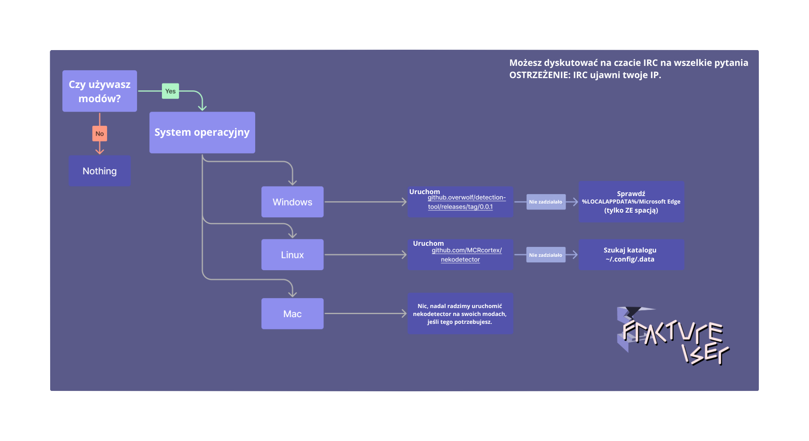
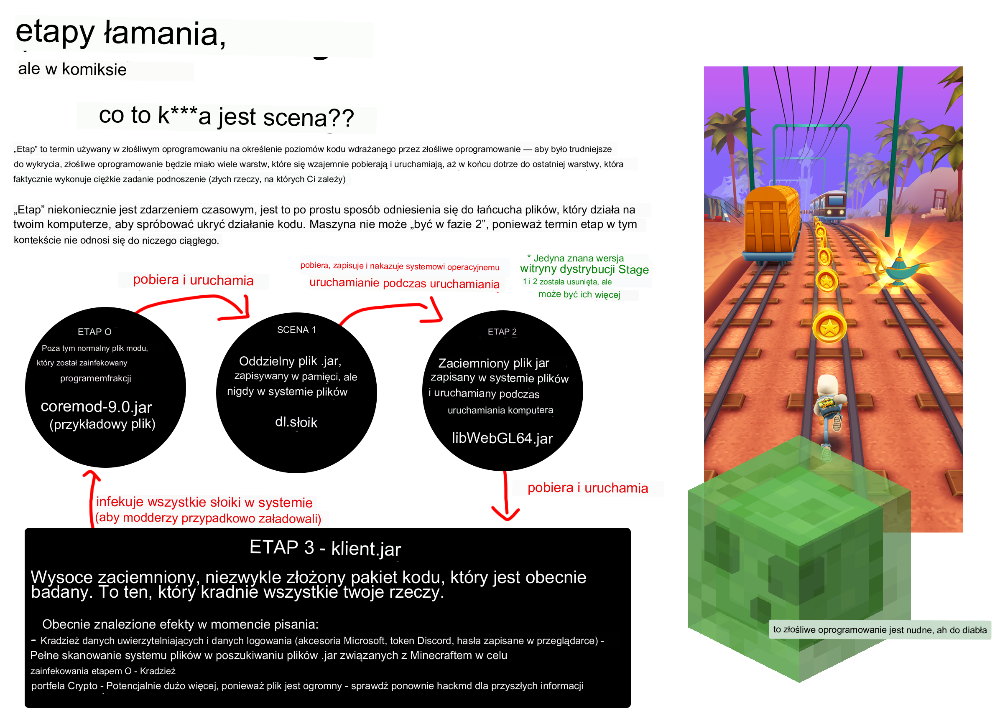
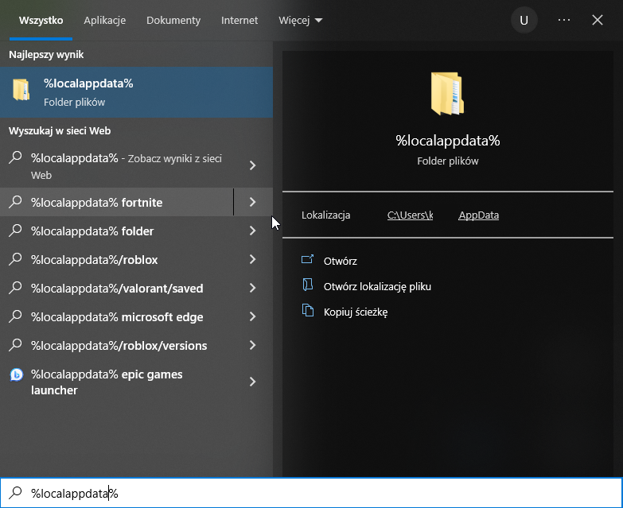

# Przewodnik dla graczy modyfikowanych

Jeśli grasz **tylko** w wersję podstawową za pośrednictwem zaufanego launchera, takiego jak oficjalny launcher lub Prism, i nigdy nie miałeś styczności z modami: jesteś w 100% bezpieczny. Na razie powinieneś trzymać się z daleka od modów.

Jeśli jesteś graczem Modded Minecraft, musisz sprawdzić, czy zostałeś zainfekowany przez złośliwe oprogramowanie fractureiser, aby upewnić się, że twoje urządzenie i dane osobowe nie są zagrożone. Możesz to zrobić, postępując zgodnie z poniższymi instrukcjami.

### Czy to wciąż trwa??
**Nie. No cóż, w pewnym sensie.**  
Na podstawie naszej obecnej wiedzy uważamy, że wirus `fractureiser` został całkowicie usunięty z obecnie dostępnych publicznych modów i paczek modów.

Nasza obecna rekomendacja mówi, że gracze, którzy przeprowadzili sprawdzanie etapu 2 na tej stronie, są bezpieczni i mogą kontynuować grę. Jednak od momentu ponownego uruchomienia możliwości przesyłania modów na CurseForge i Modrinth, istnieje potencjał, że autorzy złośliwego oprogramowania mogą tworzyć nowe wirusy.

Jesteśmy w kontakcie ze wszystkimi odpowiednimi stronami, aby ustalić protokoły, które uniemożliwią takie wydarzenia w przyszłości.

Jeśli chcesz grać, proszę wykonaj kroki diagnostyczne na tej stronie, a także zapoznaj się z sekcjami dotyczącymi tego, co należy zrobić, jeśli jesteś zainfekowany lub nie jesteś zainfekowany.

### Struktura strony
* [Co tak naprawdę się stało?](#co-tak-naprawdę-się-stało)
* [Czy jestem zainfekowany?](#czy-jestem-zainfekowany)
* [Jestem zainfekowany, co teraz?](#jestem-zainfekowany-co-teraz)
* [Nie jestem zainfekowany, co teraz?](#nie-jestem-zainfekowany-co-teraz)
* [Najczęściej zadawane pytania](#najczęściej-zadawane-pytania)
* [FAQ techniczne](#faq-techniczne)

Jeśli masz jakieś pytania dotyczące fractureiser, przeczytaj tę stronę w całości, włączając FAQ na końcu, ponieważ większość pytań, które otrzymujemy, zostało tu już odpowiedziane.

## Co tak naprawdę się stało?

Kilka niewinnie wyglądających złośliwych modów i wtyczek zostało początkowo przesłanych przez twórcę złośliwego oprogramowania na stronę hostingową modów CurseForge i na hub pluginów dev.craftbukkit.org (nie jest to jednak oprogramowanie Bukkit). Twórca popularnej paczki modów pobrał jeden z tych modów, co spowodowało zainfekowanie plików na ich komputerze bez ich wiedzy - w tym kopia działającego projektu, który został następnie przesłany na CurseForge jako pozornie legalny plik, zawierający wirusa.

Ten proces powtórzył się również w kilku innych przypadkach użytkowników korzystających z CurseForge i dev.craftbukkit.org, zainfekowując kopie kilku popularnych wtyczek i modów. *Zgłaszane są przypadki szkodliwych wtyczek i modów już od połowy kwietnia.*

Równolegle twórca złośliwego oprogramowania próbował naruszyć konta popularnych twórców treści na CurseForge poprzez ataki brute force. Obecnie nie jesteśmy pewni, czy naruszenie wynikało z próby ataku brute force, czy z infekcji trojańskiej na kontach właścicieli.

To złośliwe oprogramowanie składa się z wielu "etapów", z których każdy jest odpowiedzialny za pobranie i uruchomienie następnego. Ogółem istnieją trzy znane etapy (Etap 1, Etap 2 i Etap 3), a zainfekowane pliki modów służą jako "Etap 0", który rozpoczyna cały proces.

Etap 3 jest "mózgiem" tego złośliwego oprogramowania, a mamy dowody na to, że próbuje on wykonać następujące czynności:

* Rozprzestrzenianie się na *wszystkie* pliki `jar` na systemie plików, możliwe jest zainfekowanie modów, które nie zostały pobrane z CurseForge ani BukkitDev, ani innymi programami w języku Java.
* Kradzież plików cookie i informacji logowania dla wielu przeglądarek internetowych.
* Zastępowanie adresów kryptowalut w schowku alternatywnymi, które prawdopodobnie są własnością atakującego.
* Kradzież danych uwierzytelniających Discorda.
* Kradzież danych uwierzytelniających Microsoftu i Minecrafta.

(Zobacz [szczegóły techniczne](tech.md) dla więcej informacji)

Ze względu na swoje zachowanie jesteśmy **bardzo pewni**, że jest to **celowany atak na ekosystem modyfikowanego Minecrafta**. To jest dość poważne.

**Do odwołania prosimy o niezwykłą ostrożność przy pobieraniu modów do Minecrafta, niezależnie od ich pochodzenia.** Chociaż serwer kontrolny dla tego złośliwego oprogramowania jest obecnie offline, **pobieranie z Curseforge lub repozytorium wtyczek Bukkit z ostatnich 2-3 tygodni należy traktować jako potencjalnie złośliwe**. Niektóre skanery malware zaczęły dodawać sygnatury do swoich baz danych, ale dopóki nie zostaną one wdrożone we wszystkich skanerach, proszę zachować ostrożność.

*W tej chwili nie możemy mieć pewności, że żadna usługa hostingowa nie jest dotknięta*. Proszę zachowaj ostrożność, niezależnie od strony, którą używasz. Nawet repozytoria Maven mogą być zainfekowane, a to złośliwe oprogramowanie działało przez miesiące.

Obecnie nowe zainfekowania są niemożliwe, ponieważ serwer atakującego został wyłączony, ale istniejące infekcje mogą nadal być aktywne.

<!--### Przejdźmy do sedna, jak to naprawić?

-->

### Chwila, co to jest "etap"?




## Czy jestem zainfekowany?

Złośliwe oprogramowanie składa się z wielu etapów, więc pytanie, czy jesteś zainfekowany, w rzeczywistości dotyczy dwóch pytań:

### Czy którykolwiek z moich plików mod ma Etap 0?
Istnieje wiele skanerów, które mogą sprawdzić, czy plik modułowy jest zainfekowany Etapem 0 tego złośliwego oprogramowania.

- [Skaner Overwolfa](https://github.com/overwolf/jar-infection-scanner/releases)
  - Jest to zalecana opcja do sprawdzania całej gry - wystarczy wskazać folder instalacyjny CurseForge lub gdziekolwiek masz zapisane swoje instancje.
  - Jest to samodzielny program i nie wymaga zainstalowanego aplikacji Overwolf.
- [Strona internetowa douira](https://douira.github.io/fractureiser-web-detector/) z możliwością skanowania online
- [Nekodetektor cortexa](https://github.com/MCRcortex/nekodetector/releases)
  - Kliknij "Assets", aby wyświetlić plik do uruchomienia - wymaga zainstalowanego programu Java.

W izolacji zakażenie etapem 0 nie jest niebezpieczne, jeśli pliki zostaną usunięte i nigdy nie zostaną uruchomione.

### Czy na moim systemie są obecne pliki Etapu 2?

Obecność plików Etapu 2 na twoim systemie oznacza, że etapy 0 i 1 złośliwego oprogramowania zostały pomyślnie uruchomione. Jeśli są obecne w ogóle, jesteś prawdopodobnie *w pełni zainfekowany* i powinieneś kontynuować czytanie instrukcji w dokumencie.

Wiele programów antywirusowych zaczyna wykrywać pliki Etapu 2. Jeśli otrzymasz ostrzeżenie, że takie pliki zostały znalezione i usunięte, przejdź do sekcji "Jestem zainfekowany, co teraz?".

W przeciwnym razie możesz sprawdzić ręcznie, wykonując następujące czynności w zależności od swojej platformy:

#### Instrukcje dla systemu Windows

* Otwórz menu Start, używając klawisza Windows, i wpisz `%localappdata%` - powinno się pojawić tak:


* Wewnątrz folderu Local appdata musisz upewnić się, że Twój Eksplorator jest ustawiony na wyświetlanie "Ukrytych elementów" i "Chronionych plików systemowych".
  * Można to zrobić poprzez opcję Widok > Opcje
  * Jeśli nie wiesz, jak to zrobić, filmowa instrukcja 
  [znajduje się tutaj](https://youtu.be/KLTlTlnXeKs).
  * Użytkownicy Windows 11 mogą znaleźć te same opcje pod przyciskiem "Widok" na górnym pasku narzędziowym, 
  oraz pod przyciskiem "..." po prawej stronie.

* Zlokalizuj folder o nazwie `Microsoft Edge`. SPACJA między "Microsoft" i "Edge" jest
  ważna - `MicrosoftEdge` to legalny folder używany przez przeglądarkę Edge. Wirus
  po prostu nadał mu taką samą nazwę, aby się ukryć.
  * Legalny folder może również nosić nazwę `Microsoft\Edge` (folder `Edge` wewnątrz folderu `Microsoft`).
  * Legalny folder nie musi istnieć - jeśli nie masz żadnych folderów związanych z Edge, jesteś bezpieczny.
  * Oba legalne foldery mogą istnieć jednocześnie, to również jest w porządku.
* Jeśli `Microsoft Edge` jest obecny, oznacza to, że zostałeś zainfekowany. W takim przypadku trwale usuń
folder i wszystko w środku.
  * Jeśli folder nie można usunąć, musisz zatrzymać wszystkie działające obecnie programy Java za pomocą menedżera zadań.

#### Informacje dotyczące systemu macOS

Wygląda na to, że złośliwe oprogramowanie nie wpływa na macOS, więc powinieneś być w porządku.
*Sprawdzaj jednak tutaj od czasu do czasu, na wszelki wypadek.*

#### Instrukcje dla systemu Linux

Najpierw upewnij się, że używana przez Ciebie metoda wyświetlania plików umożliwia wyświetlanie ukrytych plików. Większość menedżerów plików GUI ma skrót Ctrl+H do przełączania widoczności ukrytych plików. Jeśli korzystasz z terminala, użyj polecenia `ls -A` w odpowiednich katalogach lub `ls -lha` dla bardziej szczegółowego wyświetlania.

Jeśli istnieją jakiekolwiek z następujących plików, zostałeś zainfekowany. W takim przypadku usuń je wszystkie:
* `~/.config/systemd/user/systemd-utility.service`
* `/etc/systemd/system/systemd-utility.service`
* `~/.config/.data/lib.jar`

Po wykonaniu tych czynności, jeśli dotyczy, sprawdź dziennik `journalctl` w poszukiwaniu jakichkolwiek zmian, których nie rozpoznajesz. Możesz to zrobić za pomocą poleceń `journalctl -exb` (dla dzienników systemowych) i `journalctl -exb --user` (dla dzienników użytkownika). Wykonaj następujące polecenia, aby odświeżyć usługi systemd:
```sh
sudo systemctl daemon-reload # Enter your user password
systemctl --user daemon-reload 
```

#### Skrypty

*Jeśli nie wiesz, jak uruchomić skrypt w PowerShell lub Bash, to nie są dla Ciebie.*  
Automatyczne skrypty PowerShell lub Bash są również dostępne [na stronie PrismLauncher](https://prismlauncher.org/news/cf-compromised-alert/#automated-script)
do sprawdzenia etapu 2, jeśli masz odpowiednie umiejętności techniczne do ich uruchomienia. Overwolf (firma-matka Curseforge)
wydało również narzędzie wykrywające etap 2 w C#: 
https://github.com/overwolf/detection-tool

## Jestem zainfekowany, co teraz?

**WAŻNE**: Obecnie nie znamy pełnego zakresu tego, co może zrobić i jakie ma intencje, dlatego należy zachować
skrajną ostrożność, dopóki nie zostanie znaleziony pełny sposób na usunięcie objawów. Wszystko tutaj przedstawione to tylko
*to, co wiemy* - proszę śledzić aktualizacje od zespołu w przypadku odkrycia czegoś krytycznego.

Jeśli znajdziesz pliki etapu 2 od fractureiser na swoim systemie, bardzo prawdopodobne jest, że kod etapu 3
został uruchomiony i zainfekował twój komputer.
Najlepszą opcją teraz jest zakładanie, że wszystko na tym systemie jest *całkowicie skompromitowane*. Powinieneś:

* Zrobić kopię zapasową wszystkiego, czego nie chcesz stracić na pendrive lub dysk zewnętrzny (powinieneś
robić to regularnie!)
* Za pomocą osobnego urządzenia, zmień hasła do wszystkich usług, do których byłeś zalogowany
  na starym komputerze (Discord, e-mail itp.). Najlepiej za pomocą menedżera haseł, takiego jak
  [BitWarden](https://bitwarden.com).
* Jeśli jeszcze nie korzystałeś z uwierzytelniania dwuskładnikowego (aplikacja autentykacyjna lub SMS) dla każdej usługi,
która go obsługuje, zacznij to robić natychmiast.
* Jeśli możesz, skontaktuj się z profesjonalną usługą w swojej okolicy, aby przeprowadzić odpowiednią
  diagnostykę swojego komputera w celu wykrycia podejrzanych rzeczy, lub w przypadku braku pewności po prostu wyczyść i
  ponownie zainstaluj system.
* Przeczytaj poniższą sekcję na temat tego, co zrobić, jeśli nie jesteś zainfekowany, ponieważ kroki tam opisane również cię dotyczą.

## Nie jestem zainfekowany, co teraz?

Jeśli skaner etapu 2 nie wykrył niczego, istnieje duża szansa, że nie dzieje się nic złego i możesz grać.

Podczas gdy `fractureiser` został usunięty, nowe wirusy mogą pojawić się w najbliższej przyszłości, dopóki nie
ustalimy nowych protokołów. Jeśli chcesz grać w grę, zalecamy:

* Graj wyłącznie w mody i paczki modyfikacji, które już pobrane i zweryfikowane jako bezpieczne.
* Unikaj pobierania czegokolwiek wrzuconego po 8 czerwca od nowych lub nieznanych autorów, z tego samego powodu co poprzedni punkt.
* Unikaj aktualizacji modów i paczek modów.
* Śledź aktualizacje od zespołu dotyczące nowych metod wykrywania problemów tego typu w przyszłości.

## Najczęściej zadawane pytania

### Czy CurseForge zostało zhakowane?
Sam CurseForge nie został skompromitowany, zainfekowani są tylko indywidualni użytkownicy. To nie jest problem CurseForge, to
po prostu miejsce, gdzie to się zdarzyło. CurseForge opublikowało również [artykuł](https://support.curseforge.com/en/support/solutions/articles/9000228509-june-2023-infected-mods-detection-tool/) opisujący sytuację z ich strony i
pracują nad wdrożeniem środków zaradczych.

### Czy Modrinth jest w porządku?
Modrinth przeskanował ostatnie 10 miesięcy wrzutów i nie znaleziono zainfekowanych projektów.
Nadal jednak zalecamy zachowanie skrajnej ostrożności podczas pobierania czegokolwiek związanego z modyfikacjami w tej chwili.
To, że tam nie było zainfekowanych modyfikacji, to była czysta kwestia szczęścia.

### Czy Modrinth jest bezpieczniejszy?
To nie jest problem związanym z samą stroną internetową, Modrinth jest tak samo bezpieczny jak CurseForge.


### Jak to mogło umknąć CurseForge?

Kod wykorzystywany przez infekcję etapu 0 nie był koniecznie podejrzany dla systemu automatycznego i mógł być używany przez inne mody. Faktycznie, wczesne heurystyki wykrywania infekcji etapu 0 wykazywały znaczną ilość fałszywych alarmów w przypadku popularnych modyfikacji, takich jak Quark.

Realistycznie rzecz biorąc, tego rodzaju zapobieganie na skalę platformy jest niemożliwe z powodu nieskończonej liczby sposobów układania kodu w celu ukrycia zamiaru.

### Które programy antywirusowe to wykrywają?

Nowe programy są dodawane w trakcie pisania, najlepiej jednak przeprowadzić ręczną weryfikację, zamiast polegać na oprogramowaniu antywirusowym.

### Czy Multiplayer jest bezpieczny?

Tak, nie można zostać zainfekowanym przez serwer multiplayer, jeśli nie pobierasz do niego modów z innych źródeł.

### Czy Bedrock jest bezpieczny?

Tak, to dotyczy tylko wersji Java.

### Czy alternatywne klienty gry, takie jak Lunar czy Badlion, są bezpieczne?

Zobacz poniższy punkt.

### Czy Optifine jest bezpieczny? / Czy Sodium jest bezpieczne? / Czy Iris jest bezpieczne? / Czy Create jest bezpieczne? / Czy Essential jest bezpieczne? / Czy (wstaw nazwę modyfikacji) jest bezpieczne?

**Obecnie nie możemy w pełni potwierdzić bezpieczeństwa żadnej konkretnej modyfikacji.**

Jedną z funkcji etapu 3 wirusa jest zainfekowanie jak największej liczby plików `.jar` na komputerze. Może zainfekować **wszystkie pliki `.jar`**, w tym samego Minecrafta (wersję podstawową/zmodowaną), mody do Minecrafta, wtyczki Spigot i niezwiązane aplikacje Java. Dlatego niezależnie od tego, czy pobierasz "bezpieczną" modyfikację, jeśli twój komputer posiada część etapu 3 wirusa, zostanie ona zainfekowana. Znajdź i usuń późniejsze etapy wirusa fractureiser *najpierw*.

W tej chwili wszystkie *znane* zainfekowane modyfikacje zostały usunięte z CurseForge. CurseForge [opublikowało listę znanych zainfekowanych modyfikacji](https://support.curseforge.com/en/support/solutions/articles/9000228509-june-2023-infected-mods-detection-tool/) (dolna część strony) i usunęło je ze strony internetowej. Modrinth przeskanował 10 miesię

cy wstecz i nie znalazł żadnych zainfekowanych modyfikacji.

To jednak *nie gwarantuje, że żadne podstępne mody nie umknęły*. Aby sprawdzić, czy dany plik `.jar` zawiera etap 0 fractureisera, sprawdź sekcję [Czy jestem zainfekowany?](#am-i-infected) i ogólnie ostrożnie pobieraj cokolwiek związanego z modami.

### Jak szeroka była infekcja?

CurseForge podaje, że zarażone pliki zostały pobrane około 6 000 razy przez cały okres infekcji. Cytując ogłoszenie z serwera Discord CF:
> Dla odniesienia, stanowi to około 0,015% codziennych pobrań CurseForge dla Minecrafta.

### Czy ktoś chciał zepsuć wydarzenie wydania wersji 1.20?

Wydaje się, że było to przypadkowe zbiegiem okoliczności. Kampania związana z tym malwarem była aktywna dość długo przed powszechnym ujawnieniem się tego ranka, w dniu wydania wersji 1.20.

## FAQ techniczne

### Czy fractureiser może uciec z maszyn wirtualnych (VM)?

**Nie.**

Etap 3 *zawiera kod* *próby* *ręcznej* ucieczki z ["Windows Sandbox"](https://learn.microsoft.com/en-us/windows/security/application-security/application-isolation/windows-sandbox/windows-sandbox-overview). Nie dzieje się to automatycznie. Jeśli wirus jest uruchamiany w środowisku Windows Sandbox, spróbuje ingerować w schowek, aby oszukać i wkleić skrót do złośliwego oprogramowania.

Należy jednak zauważyć, że tego rodzaju "ucieczka ze schowka" to nic nowego i bardzo łatwo ją pokonać, po prostu nie dzieląc schowka między systemem hosta a systemem gościa. Używaj bardziej zaawansowanej maszyny wirtualnej niż "Windows Sandbox" i wyłączaj funkcje takie jak "Dodatki gościa" w VirtualBox lub "Usługi integracji" w Hyper-V.

(Rzeczywiste ataki na ucieczkę z wirtualnych maszyn są warte miliony dolarów i nie byłyby wykorzystane na kilku dzieciach grających w Minecrafta, a mamy powody sądzić, że autor tego złośliwego oprogramowania nie jest bardzo dobrym programistą.)

### Czy wirus rozprzestrzenia się przez sieć?

O ile wiemy, fractureiser nie zawiera funkcji rozprzestrzeniania się przez sieć, ale nie można tego całkowicie wykluczyć.  
Badacz bezpieczeństwa, z którym współpracujemy, otrzymał alert, ale okazało się, że dotyczył on zupełnie niezwiązanych z nim złośliw

ych oprogramowań, które przypadkiem miały podobną nazwę pliku. Był to fałszywy alarm.

### Co robią CurseForge i Modrinth w tej sprawie?

CurseForge opracował narzędzie wykrywania etapów 2/3 [open-source](https://github.com/overwolf/detection-tool) i narzędzie wykrywania etapu 0 [open-source](https://github.com/overwolf/jar-infection-scanner), przeskanował *wszystkie* przesłane mody/pluginy pod kątem infekcji etapu 0 i usunął wszystkie *znane* przypadki infekcji.

Modrinth również przeskanował przesłane mody/pluginy pod kątem infekcji etapu 0 sięgając 10 miesięcy wstecz i nie znalazł żadnych przypadków infekcji.

Obie platformy rozważają wprowadzenie pewnego rodzaju automatycznego procesu "skanowania wirusów" w procesie przesyłania modyfikacji. To trudne zadanie, ponieważ złośliwe oprogramowanie Java jest zwykle spersonalizowane.

### Jakie adresy IP i adresy URL powinienem zablokować w moim firewallu/tabeli routingu?

Związek związany z fractureiserem został zauważony w łączeniu się z tymi adresami URL i adresami za pomocą różnych numerów portów.

* Adres zakodowany na stałe w zainfekowanych modach etapu 0 i pierwszy obserwowany serwer kontrolny: `85.217.144.130`
* Drugi obserwowany serwer kontrolny: `107.189.3.101`
* Adres URL, którego próbuje użyć etap 1 i nazwa hosta dla kontrolera etapu 2: `files-8ie.pages.dev`

Istnieje również dowód na próbę połączenia się z nazwą hosta `v2202209151437200088` na porcie 25575 - powody są nieznane; prawdopodobnie związane z wcześniejszą wersją złośliwego oprogramowania.

Oto dodatkowe adresy do zablokowania w związku z "skyrage" (ponownie, *bardzo* mało prawdopodobne, aby skyrage zostało pobrane na czyjś komputer za pomocą tego wektora, ale nic dobrego nie wynika z tych adresów):

* `95.214.27.172`
* `connect.skyrage.de`
* `t23e7v6uz8idz87ehugwq.skyrage.de`
* `qw3e1ee12e9hzheu9h1912hew1sh12uw9.skyrage.de`
* *Najlepiej zablokować całe `skyrage.de`*

Nie trzeba chyba mówić, że nie należy odwiedzać tych stron.

### Czy możemy wprowadzić zakaz pobierania innych plików przez mod w ramach zasad CurseForge/Modrinth?

Zakaz przesyłania z

ewnętrznych plików jest niepraktyczny, ponieważ modyfikacje często wymagają zewnętrznych zasobów, takich jak pliki konfiguracyjne, tekstury itp. Niemniej jednak, obie platformy pracują nad poprawą systemu weryfikacji i bezpieczeństwa, aby minimalizować ryzyko związane z pobieraniem plików przez modyfikacje.

### Czy mogę uzyskać pełną listę zainfekowanych modyfikacji?

CurseForge opublikowało [listę znanych zainfekowanych modyfikacji](https://support.curseforge.com/en/support/solutions/articles/9000228509-june-2023-infected-mods-detection-tool/). Modrinth przeprowadził skanowanie wsteczne do 10 miesięcy wstecz i nie znalazł żadnych zainfekowanych modyfikacji.

Należy jednak pamiętać, że infekcja etapu 0 była szeroko rozpowszechniona, a fractureiser jest w stanie zainfekować *wszystkie pliki `.jar`* na komputerze, nie tylko modyfikacje. Dlatego zalecamy wykonanie ręcznego skanowania swoich plików `.jar` zgodnie z sekcją [Czy jestem zainfekowany?](#am-i-infected).

### Czy usunięcie zainfekowanego moda wystarczy, aby usunąć wirusa?

Usunięcie samego zainfekowanego moda nie wystarczy do usunięcia wirusa. Zainfekowane modyfikacje to tylko jeden aspekt wirusa fractureiser, który może zainfekować *wszystkie* pliki `.jar` na komputerze, w tym samą grę Minecraft, mody do Minecrafta, wtyczki Spigot itp. Musisz odnaleźć i usunąć wszystkie etapy wirusa fractureiser z komputera, zaczynając od etapu 3, a następnie etapu 2 i etapu 1.

Sprawdź sekcję [Jak mogę usunąć wirusa?](#how-can-i-remove-the-virus) dla szczegółowych instrukcji dotyczących usuwania wirusa fractureiser. Pamiętaj, że najlepiej jest skonsultować się z ekspertem ds. bezpieczeństwa komputerowego, aby uzyskać pomoc w usunięciu wirusa.

### Dlaczego mody nie są podpisywane kryptograficznie, aby zapobiec manipulacji złośliwym oprogramowaniem?

Częścią problemu jest to, że same podpisy nie zapobiegają złośliwemu oprogramowaniu - wirus podpisany kryptograficznie nadal jest wirusem - a jeśli byłoby dozwolone samodzielne podpisywanie, to nie zapobiega to również manipulacji - wirus może po prostu usunąć cyfrowe podpisy z pliku JAR ("usuń META-INF") i podpisać go własnym kluczem. (To nie jest hipotetyczne, ponieważ program fractureiser zawiera kod do usuwania cyfrowych podpisów z zainfekowanych plików JAR.)

Podpisane mody z weryfikacją podpisu online wydają się być obiecującym kierunkiem, chociaż nie są pozbawione kompromisów. Odbędzie się [spotkanie](2023-06-08-meeting.md) z udziałem wielu przedstawicieli ekosystemu modowania, aby omówić dalsze kroki.

### Czy byłoby możliwe zabronienie modom pobierania kodu wykonywalnego?

To niemożliwe. Nie można stwierdzić, czy plik zawiera kod wykonywalny przed pobraniem, a po pobraniu nie można kontrolować, co z nim jest robione.

* Co jeśli mój mod pobiera pojedynczy plik klasy Java?
* A co z plikiem klasy Java, ale napisanym wspak, więc na pierwszy rzut oka nie wygląda jak plik klasy?
* A co z plikiem klasy Java zaszyfrowanym?
* A co z kodem źródłowym Java, który jest kompilowany na twoim komputerze?
* A co z skryptem Pythona?
* A co z plikiem zawierającym angielską prozę, gdzie zdania składające się z parzystej liczby słów odpowiadają 0, a zdania składające się z nieparzystej liczby słów odpowiadają 1? - chociaż to jest dokument prozatorski, technicznie mogę go ponownie złożyć w plik `.exe`, jeśli tak zdecyduję.

### Czy to ma związek z obiegiem złośliwego oprogramowania wtyczek Spigot?

Możliwe! Istnieje pewne powiązanie z istniejącym złośliwym oprogramowaniem o nazwie `skyrage` - autor złośliwego oprogramowania przesłał istotny dla `skyrage` plik `.jar` na swoje zapasowe serwery komend i kontrolowania w bezowocnej próbie rozszerzenia ataku, krótko przed tym, jak CloudFlare go zablokował.

**Nie otrzymaliśmy żadnych raportów o zainfekowaniu przez Skyrage poprzez ten wektor.** Autor zaktualizował adres URL CloudFlare'a w

skazujący na Skyrage znacznie *po* tym, jak sztywno zakodowany adres IP w zainfekowanych modach etapu 0 został już unieszkodliwiony. To głównie ciekawostka, że atakujący próbował w ogóle serwować ten plik JAR.

skyrage to istniejące, dobrze zbadane złośliwe oprogramowanie, a więcej informacji na jego temat można znaleźć [tutaj](https://ljskatt.no/analysis/updater_class/).