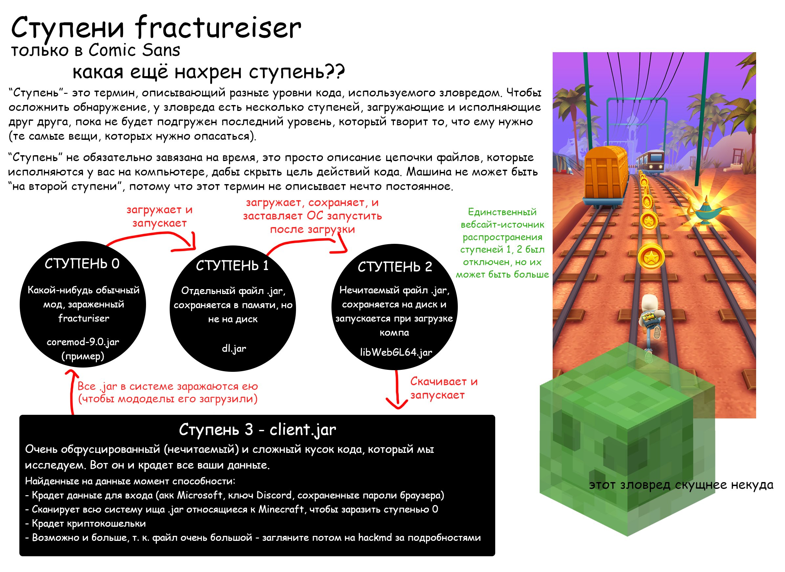

# Руководство для игроков с модами

Если вы **играете только** в ванильную игру через проверенный лаунчер, например как официальный лаунчер от Mojang или Prism, и никогда не трогали моды: вы в 100% безопасности. Держитесь пока что подальше от модов.

Если вы играете в Minecraft с модами, вам необходимо проверить, не заражены ли вы
вредоносной программой fractureiser, чтобы убедиться, что ваша машина и личные данные не подверглись риску.
Это можно сделать с помощью приведенных ниже инструкций.

### Это все еще продолжается??
**Нет. Ну, вроде того.**
На данный момент, с нашими текущими знаниями, мы считаем, что вирус `fractureiser` был полностью вычищен
из нынешних публичных модов/модпаков.

Наша текущая рекомендация заключается в том, что игроки, запустившие проверяльщик второй ступени (stage 2 checker) с этой страницы, могут спокойно
продолжать играть, однако, поскольку загрузка модов была возобновлена на CurseForge
и Modrinth, появилась возможность для вирусописателей-подражателей создать новые вирусы.

Мы в контакте со всеми затронутыми сторонами для установления протоколов, чтобы этого не произошло
в будущем.

Если вы хотите поиграть, пожалуйста, пройдите описанные на странице шаги для диагностики, а также последующие
разделы о том, что делать, если вы заражены или не заражены.

### Структура страницы
* [Что на самом деле произошло?](#что-на-самом-деле-произошло)
* [Заражен ли я?](#заражен-ли-я)
* [Я заражен, что теперь?](#я-заражен-что-теперь)
* [Я не заражен, что теперь?](#я-не-заражен-что-теперь)
* [Часто задаваемые вопросы](#часто-задаваемые-вопросы)
* [Техническое FAQ](#техническое-faq)

Если у вас возникли вопросы о fractureiser, прочтите эту страницу полностью, включая FAQ в
в конце, так как на большинство из полученных нами вопросов, здесь есть ответ.

## Что на самом деле произошло?

Несколько невинных на вид вредоносных модов и плагинов были первоначально загружены создателем вредоносной программы 
на сайт хостинга модов CurseForge и на хаб плагинов dev.bukkit.org (не на сам сервер Bukkit).
Высокопоставленный разработчик модпака загрузил один из этих модов, чтобы попробывать,
что привело к зарежению файлов на компьютере без его ведома - в том числе копию
рабочего проекта, который впоследствии будет загружен на CurseForge как, на первый взгляд, нормальный файл,
с внедренным вирусом.

Затем этот процесс повторился еще в нескольких случаях с пользователями CurseForge и 
dev.bukkit.org, заражая копии нескольких популярных плагинов и модов.
*Есть сообщения о вредоносных jar-файлах плагинов и модов, датированных серединой апреля.*

Наряду с этим, автор вредоносной программы пытался через подбор получить доступ к аккаунтам создателей контента с высокой посещаемостью на CurseForge.
В настоящее время мы не знаем, с чего началась брешь: из-за успешного перебора паролей или заражения трояном владельцев аккаунтов.

Эта вредоносная программа состоит из нескольких "ступеней", каждая из которых отвечает за загрузку и
запуск последующей. Всего известно три ступени (Ступени 1, 2, и 3), при этом зараженные
файлы модов служат в качестве "Ступени 0", запускающей весь процесс.

Ступень 3 - это "главный герой" вредоносной программы, и у нас есть доказательства того, что она пытается сделать
следующее:

* распространить себя на *все* `jar` файлы в файловой системе, наверняка заражая моды, которые
  не были загружены с CurseForge или BukkitDev, и другие Java-программы.
* Кража cookies и данных для входа из многих веб-браузеров
* Замена криптовалютных адресов в буфере обмена на другие, предположительно, принадлежащим
злоумышленнику
* Кража учетных данных Discord
* Кража учетных данных Microsoft и Minecraft

(Более подробную информацию см. в [технических деталях](tech.md))

Судя по поведению, мы **очень уверены**, что это - **целенаправленная атака на
экосистему модов для Minecraft**. Дела плохи.

**До дальнейшего уведомления проявляйте крайнюю осторожность при загрузке модов Minecraft, независимо от их
происхождения.** Хотя сервер управления этой вредоносной программой в настоящее время находится в оффлайне, **любая
загрузка с Curseforge или репозитория плагинов Bukkit за последние 2-3 недели (9 июня 2023 г.) должна
рассматриваться как потенциально вредоносная**. Некоторые антивирусы начали добавлять сигнатуры
в свои базы данных, но пока это не дойдет до всех, пожалуйста, будьте осторожны.

*На данный момент мы не можем с уверенностью утверждать, что ни один хостинг-сервис не пострадал*. Пожалуйста,
проявлять осторожность независимо от того, какой сайт вы используете. Даже репозитории Maven могут быть заражены,
а эта вредоносная программа существует уже несколько месяцев.

В настоящее время новые заражения невозможны, так как сервер злоумышленника был отключен,
существующие заражения могут быть все еще активны.

<!--### Get to the point, how do I fix this?

-->

### какая ещё нахрен ступень?



## Заражен ли я?

У вредоноса есть несколько ступеней, поэтому вопрос, не заражены ли вы, фактически состоит из двух вопросов.

### Есть ли в моих мод-файлах Ступень 0?
Существует множество сканеров, которые берут файл мода и определяют, заражен ли он Ступенью 0
вредоноса.

* [Сканер](https://github.com/overwolf/jar-infection-scanner/releases) от Overwolf
  * Рекомендуемый вариант для проверки всей игры - просто направьте его на папку с установленным CurseForge
или в любое другое место, где у вас сохранены игровые сборки.
  * Это отдельная программа, не требующая установки приложения Overwolf.
* [вебсайтовый онлайн сканер](https://douira.github.io/fractureiser-web-detector/) от douira
* [nekodetector](https://github.com/MCRcortex/nekodetector/releases) от cortex
  * Нажмите на "Assets", чтобы показать запускаемый файл - требует установленной Java.

Само по себе, заражение нулевой ступенью не опасно, если файлы будут удалены и никогда не запускались.

### Присутствуют ли в моей системе файлы Ступени 2?

Наличие файлов второй ступени в системе означает, что ступени 0 и 1 вредоноса успешно отработали.
Если они вообще присутствуют, вы, скорее всего, *полностью заражены* - продолжайте читать
инструкции изложенные здесь.

Многие антивирусные сканеры начинают обнаруживать файлы второй ступени. Если вы получите предупреждение о том, что такие
файлы были найдены и удалены, перейдите к разделу "Я заражен, что теперь?".

Иначе, вы можете проверить вручную, произведя следующие действия в зависимости от вашей платформы:

#### Инструкции для Windows

* Откройте меню Пуск с помощью клавиши Windows и введите `%localappdata%`, должно появиться следующее:


* Внутри папки Local AppData вы должны убедиться, что в проводнике включена настройка для показа как
"Показывать скрытые файлы, папки и диски", так и отключено "Скрывать защищенные системные файлы (рекомендуется)".
  * Это можно сделать в меню Вид > Параметры
  * Если вы не знаете, как это сделать, видео объяснение 
[можно найти здесь](https://youtu.be/KLTlTlnXeKs).
  * Пользователи Windows 11 могут найти те же опции под кнопкой "Вид" на верхней ленте,
а также за кнопкой "..." с её правого края.

* Найдите папку с именем `Microsoft Edge`. ПРОБЕЛ между словами "Microsoft" и "Edge" важен,
потому что `MicrosoftEdge` - это настоящая папка, используемая Edge.
Вирус просто назвал ее таким образом, чтобы замаскировать себя.
  * Настоящая папка также может называться `Microsoft\Edge` (т.е. папка `Edge` внутри папки
папки `Microsoft`).
  * Настоящая папка не обязательно будет существовать - если у вас нет никаких папок, связанных с Edge,
вы в безопасности.
  * Обе настоящие папки могут существовать одновременно, это тоже нормально.
* Если присутствует `Microsoft Edge` - вы были заражены. Если это так, удалите навсегда папку
папку и все, что в ней находится.
  * Если папка не может быть удалена, вы должны остановить все запущенные Java-программы через Диспетчер задач.

#### Информация для MacOS

Похоже, что вредонос не затрагивает MacOS, так что все должно быть в порядке.
*На всякий случай заглядывайте сюда время от времени.*

#### Инструкции для Linux

Во-первых, убедитесь, что чем бы вы не пользовались для отображения списка файлов, есть возможность просмотра скрытых файлов.
У большинства GUI файловых менеджеров есть сочетание клавиш Ctrl+H для переключения скрытых файлов.
Если вы в терминале,
используйте `ls -A` в соответствующих каталогах, или `ls -lha` для более подробного списка.

Если существует любой из следующих файлов, значит, вы были заражены. Если есть, удалите их все:

* `~/.config/systemd/user/systemd-utility.service`
* `/etc/systemd/system/systemd-utility.service`
* `~/.config/.data/lib.jar`

После этого, если применимо, проверьте `journalctl` на наличие изменений, которые не узнаете.
Это можно сделать с помощью команд `journalctl -exb` (для системных журналов) и `journalctl -exb --user`
(для пользовательских журналов). Выполните следующие команды, чтобы обновить службы systemd:

```sh
sudo systemctl daemon-reload # Введите пароль пользователя
systemctl --user daemon-reload 
```

#### Скрипты

*Если вы не знаете, как запустить скрипт PowerShell или Bash, это не для вас*.

Автоматические сценарии PowerShell или Bash также доступны
[на сайте PrismLauncher](https://prismlauncher.org/news/cf-compromised-alert/#automated-script)
для проверки на наличие второй ступени за вас, если вы знаете, как их запустить. Overwolf (материнская компания Curseforge) также выпустила инструмент для обнаружения второй ступени на C#:
https://github.com/overwolf/detection-tool

## Я заражен, что теперь?

**ВАЖНО**: В настоящее время мы не знаем ни полного охвата всего, на что способна эта программа, ни ее
намерений, поэтому следует проявлять крайнюю осторожность до тех пор, пока не будет найден полный способ устранения любых симптомов.
Все изложенное здесь - это только *то, что мы знаем* - пожалуйста, следите за сообщениями от команды,
если будет найдено что-то критически важное.

Если вы обнаружили в своей системе файлы второй ступени fractureiser, очень вероятно, что код третьей ступени
запускался и заразил ваш компьютер.
Лучший вариант для вас сейчас - считать, что все в системе *полностью скомпрометировано*. Вам следует:

* Создать резервную копию всего, что вы не хотите потерять, на флэшке или внешнем диске (и без того должны это делать регулярно!).
* Используя отдельное устройство, смените пароли ко всем сервисам, в которые вы входили на старом компьютере (Discord, электронная почта, и т.д.). Желательно использовать менеджер паролей, например
[BitWarden](https://bitwarden.com).
* Если вы еще не пользуетесь двухфакторной аутентификацией (через приложение телефона или SMS) во всех сервисах,
которые ее поддерживают, пожалуйста, включите её как можно быстрее.
* Если можете, обратитесь к компьютерному мастеру для проведения надлежащей
диагностики вашего компьютера на предмет чего-либо подозрительного, или в качестве безопасного типичного решения просто сотрите и переустановите систему.
* Прочитайте раздел ниже о том, что делать, если вы не заражены, так как описанные там действия применимы и к вам.

## Я не заражен, что теперь?

Если детектор второй ступени ничего не обнаружил, есть вероятность, что ничего не произошло и можно продолжать
играть.

Хотя `fractureiser` был вычищен, новые вирусы могут появиться в ближайшем будущем, пока мы не согласуем новые протоколы.
Если вы хотите играть, мы рекомендуем:

* Играть исключительно с модами и модпаками, которые вы уже скачали и убедились в их безопасности.
* Избегать загрузки всего, что загружено после 8 июня от новых или неизвестных авторов, по той же причине, что и в предыдущем пункте.
* Избегайте обновлений ваших мод(паков).
* Следите за сообщениями команды о новых методах обнаружения подобных проблем в будущем.

## Часто задаваемые вопросы

### Взломан ли CurseForge?
Сам CurseForge не взломан, только отдельные пользователи. Это не проблема CurseForge, они
просто оказались тем местом, где это произошло. CurseForge также [опубликовал статью](https://support.curseforge.com/en/support/solutions/articles/9000228509-june-2023-infected-mods-detection-tool/), описывающую ситуацию с их стороны, и
они работают над развертыванием контрмер.

### С Modrinth все в порядке?
Modrinth провел полное сканирование последних 10 месяцев загрузок и не обнаружил зараженных проектов. 
Мы по-прежнему рекомендуем проявлять крайнюю осторожность при загрузке всего, что связано с модами. 
То что ни один мод не был заражен - целиком удача.

### Безопаснее ли Modrinth?
Это не проблема уровня сайта, Modrinth так же безопасен, как и CurseForge.

### Как CurseForge позволил этому проскользнуть?
Код, который выполняла инфекция нулевой ступени, не обязательно был подозрительным для автоматической системы,
и вполне мог быть тем, что использовал бы другой мод. На самом деле, ранние эвристики для определения
нулевой ступени заражения дали значительное количество ложных срабатываний на популярных модах, таких как Quark.

В действительности этот тип противомер в масштабах платформы неосуществим из-за бесконечного количества
различных способов, которыми можно структурировать код, чтобы скрыть свои намерения.

### Какие антивирусы ловят это?
По ходу разговора их число растет, но лучше всего сделать ручную проверку как выше и пока что не
полагаться на антивирус.

### Безопасен ли мультиплеер?
Да, вы не можете быть заражены через многопользовательский сервер, если вы не скачиваете моды для него откуда-либо.

### Безопасен ли Bedrock?
Да, это касается только Java.

### Безопасны ли альтернативные игровые клиенты, такие как Lunar или Badlion?
См. пункт ниже.

### Безопасен ли Optifine? / Безопасен ли Sodium? / Безопасен ли Iris? / Безопасен ли Create? / Безопасен ли Essential? / Безопасен ли (подставить мод)?

**В настоящее время мы не можем полностью подтвердить безопасность того или иного мода.**

Одна из функций третьей ступени вируса - заразить столько .jar-ов, сколько он сможет найти на вашем компьютере.
Он может заразить **все `.jar`**, включая сам Minecraft (ванила/модифицированный), Minecraft
моды, плагины Spigot и иные Java-приложения. Так что если на вашем компьютере есть часть третьей ступени
вируса, не имеет значения, является ли загруженный вами мод "безопасным" - он *будет* заражен.
Обнаруживайте и удаляйте более поздние ступени вируса *в первую очередь*.

На данный момент все *известные* зараженные моды были удалены с CurseForge. CurseForge [опубликовал 
список известных зараженных модов](https://support.curseforge.com/en/support/solutions/articles/9000228509-june-2023-infected-mods-detection-tool/) (внизу
страницы) и удалил их с сайта. Modrinth просканировал на 10 месяцев назад и не нашел ни одного зараженного мода.

Это *не гарантирует, что какой-то из них не прошел сквозь пальцы*. Чтобы проверить, содержит ли данный jar
нулевую ступень вируса, проверьте раздел [Заражён ли я?](#заражен-ли-я) и в целом проявляйте
крайнюю осторожность при загрузке всего, что связано с модами.

### Насколько широко распространилось заражение?

CurseForge сообщает, что зараженные файлы были скачаны примерно 6000 раз за весь
период заражения. Цитата сообщения CF в Discord:
> Для сравнения, это около 0,015% от ежедневных скачиваний CurseForge по Minecraft.

### Кто-то хотел подпортить выход 1.20?

Похоже на совпадение - эта кампания зловреда была активна в течение довольно длительного времени до того, как была
широко раскрыта утром, когда вышла версия 1.20.

## Техническое FAQ

### Может ли fractureiser вырваться из ВМ (виртуальных машин)?

**Нет.**

Ступень 3 *содержит* код для *попытки* лишь *ручного* выхода из
["Windows Sandbox"](https://learn.microsoft.com/en-us/windows/security/application-security/application-isolation/windows-sandbox/windows-sandbox-overview).
Это не произойдет автоматически. Если вирус запускается из "Песочницы Windows", он попытается
использовать буфер обмена, чтобы через вас вставить ярлык вредоносной программы.

Обратите внимание, что в подобном "выходе из буфера обмена" нет ничего нового, и его очень легко обезвредить, если просто
не делиться буфером обмена между основной и гостевой ОС. Используйте виртуальную машину по-серьезнее
чем "Windows Sandbox", и отключите такие функции как "гостевые дополнения" VirtualBox или
"службы интеграции" Hyper-V.

(*Реальные* эксплойты для выхода из виртуальной машины стоят миллионы долларов и их не будут тратить на
школоту из Minecraft, и помимо того у нас есть основания полагать, что автор этого зловреда
программист не очень).

### Распространяется ли это по сети?

Насколько нам известно, fractureiser не содержит функции распространения по сети, но полностью исключить такое нельзя.
Исследователь безопасности, с которым мы работаем, получил предупреждение, но это оказалось про совершенно
другое вредоносное ПО, которое случайно использовало похожее имя файла. Так что была просто ложная тревога.

### Что CurseForge и Modrinth делают по этому поводу?

CurseForge разработал инструмент обнаружения [ступеней 2, 3](https://github.com/overwolf/detection-tool) с открытым исходным кодом
и [инструмент обнаружения нулевой ступени](https://github.com/overwolf/jar-infection-scanner), просканировали *все*
загруженные моды/плагины на наличие инфекций нулевой ступени, и удалили все *известные* случаи заражения.

Modrinth также просканировал загруженные моды/плагины на наличие нулевой ступени заражения за последние 10 месяцев и не
и не нашел ничего.

Обе платформы рассматривают возможность введения некоторого автоматизированного процесса "проверки на вирусы" при загрузке модов.
Это сложно, поскольку подобные вредоносные программы на Java обычно создаются целенаправленно.

### Какие IP-адреса и URL-адреса следует заблокировать в моем брандмауэре/таблице маршрутизации?

Было замечено, что код, связанный со взломом, подключается к этим URL и адресам через множество
разных номеров портов.

* Жестко прописанный адрес в модах, зараженных нулевой ступенью, и первый замеченный управляющий
сервер: `85.217.144.130`
* Второй наблюдаемый сервер C&C: `107.189.3.101`
* Запасной URL, который пытается использовать первую ступень, и имя C&C-хоста второй ступени:
`files-8ie.pages.dev`.

Также есть доказательства того, что он пытается подключиться к хосту `v2202209151437200088`
через порт 25575 - непонятно зачем; наверное, отстатки старой версии вредоноса.

Вот несколько дополнительных адресов для брандмауэра, связанных с skyrage (опять же, *очень* маловероятно, что
skyrage был загружен на чей-либо компьютер этим способом, но ничего хорошего от этих адресов все равно не будет):

* `95.214.27.172`
* `connect.skyrage.de`
* `t23e7v6uz8idz87ehugwq.skyrage.de`
* `qw3e1ee12e9hzheu9h1912hew1sh12uw9.skyrage.de`
* *Знаете, заблокируйте хоть весь `skyrage.de`.*

Само собой разумеется, что не стоит их посещать.

### Можем ли мы сделать так, чтобы загрузка других файлов модами была запрещена правилами CurseForge/Modrinth?

Загрузка вредоносных программ уже запрещена правилами CurseForge. Есть также много хороших причин
для загрузки файлов модом, что также воспрепятствовало бы этому.

### Можно ли включить какой-нибудь "антивирус" или "песочницу" в сам модлоадер?

"Антивирус": Скорее нет, по тем же причинам, по которым обычные антивирусы не обнаруживают его.
Антивирусы могут обнаружить только известные вредоносные программы, но не неизвестные.

Песочница: Включение проверки типа "содержит ли этот класс "безопасный" код?" -
отличный способ подбудить к игре в кошки-мышки между разработчиками зловредов и разработчиками модлоадеров.

Очень трудно запретить Java-коду использовать определенный класс (скажем, `URLClassLoader`), потому что вы
можете также сослаться на него с помощью `Class.forName` (у которого много нормальных случаев использования), и если вы
его запретите полностью или *его часть* со списком запрещенных классов, то обычно можно найти что-то *другое* в пути классов,
что вызвало бы `Class.forName` за нас, а попытка избавиться от этих гаджетов - это бесконечная
бесконечная игра в кошки-мышки.

Песочница в Java практически невозможна - см. такие статьи, как
["Twenty Years of Escaping the Java Sandbox"](https://www.exploit-db.com/papers/45517).

Java-моды - это просто наборы произвольного кода: смотрите на них как на `.exe` - они могут делать всё, что угодно.

### Почему моды не имеют криптографической подписи, чтобы предотвратить подделку их вредоносным ПО?

Отчасти проблема в том, что подписи сами по себе не предотвращают вредоносное ПО - вирус с криптографической подписью остается вирусом - и если бы самоподписание было разрешено, то это также не предотвращает подделывание -
вирус может просто снять цифровые подписи с jar-файла ("удалить META-INF") и 
и заново подписать его своим ключом. (Это тоже не выдумка: fractureiser действительно содержит код, позволяющий
удалять цифровые подписи из зараженных им jar-файлов).

Подписанные моды с проверкой подписи онлайн *кажутся* несколько перспективным направлением,
хотя и не без компромиссов. Будет проведена [встреча](2023-06-08-meeting.md) с
многими представителями экосистемы моддинга, чтобы обсудить наши дальнейшие действия.

### Можно ли запретить модам загружать исполняемый код?

Это невозможно. Нельзя узнать, содержит ли файл исполняемый код до того, как вы его скачаете,
а после того, как файл скачан, вы не можете контролировать, что с ним будет твориться.

* Что если мой мод загружает один файл класса Java?
* Что насчет файла класса Java, но написанного задом наперед, так что на первый взгляд он не выглядит как файл класса?
* Как насчет файла класса Java, но зашифрованного?
* Как насчет исходного кода Java, который компилируется на вашем компьютере?
* Как насчет скрипта Python?
* Как насчет файла, содержащего английскую прозу, где - *какое совпадение* -
0 соответсвует предложениям с четным количеством,
а 1 предложениям с нечетным количеством слов? Даже если это, грубо говоря, проза, то я мог бы пересобрать его
в `.exe`, если захотел.

### Связано ли это с нынешним вредоносным плагином Spigot?

Возможно! Есть некоторые связи с существующим зловредом `skyrage` - автор вредоноса загрузил `.jar`
относящийся к skyrage на свой резервный управляющий сервер, в тщетной попытке
продлить атаку, незадолго до того, как CloudFlare все равно отключила сервер.

**Мы не получали сообщений о том, что кто-то заразился Skyrage этим путем**.
Автор обновил свой URL на CloudFlare, чтобы тот указывал на Skyrage через значительное временя *после* того,
как жестко прописанный в зараженных модах нулевой ступени IP-адрес уже был отключен.
В основном это забавный факт, что атакующий вообще попытался распространить этот jar.

Skyrage - это уже существующий, хорошо изученный вредонос, подробности о нем
[здесь](https://ljskatt.no/analysis/updater_class/).
