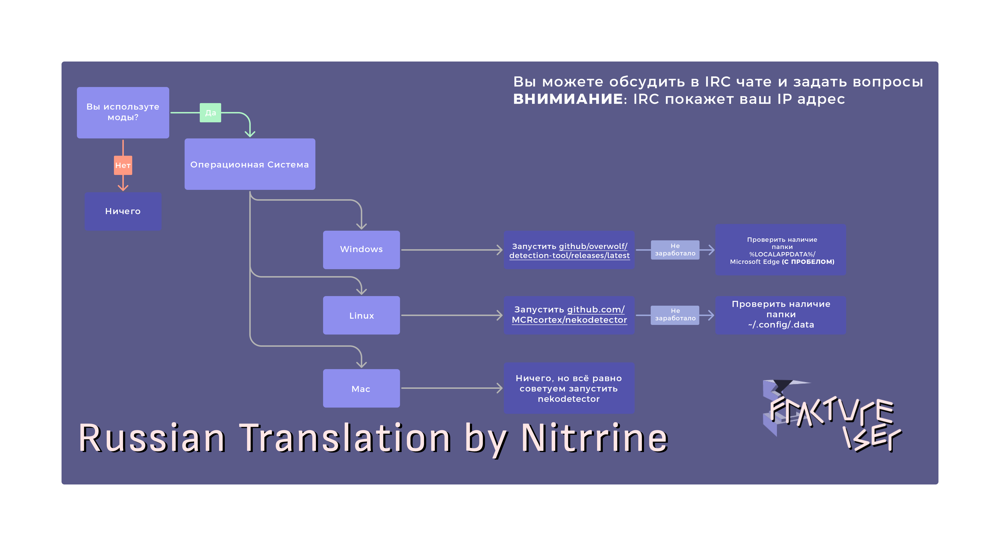
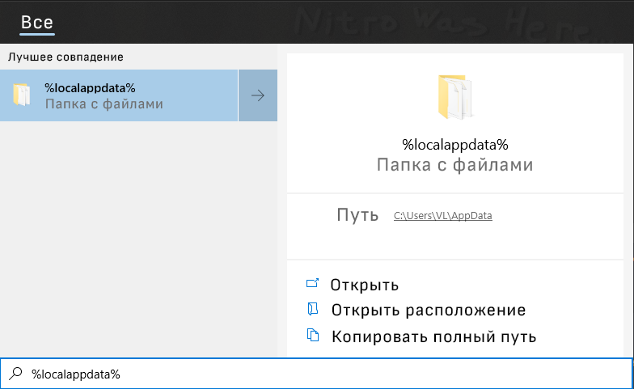

# Руководство для игроков с модами

Если вы **играете только** в ванильную игру через надёжный лаунчер, например как официальный лаунчер от Mojang или Prism, и никогда не трогали моды: вы в 100% безопасности. Держитесь пока-что подальше от модов.

Если вы играете в Minecraft с модами, вам необходимо проверить, не заражены ли вы
вредоносной программой fractureiser, чтобы убедиться, что ваша машина и личные данные не подвергаются риску. Вы можете сделать это
с помощью приведенных ниже инструкций.

### Это все еще продолжается??
**Нет. Ну, вроде того.**  
На данный момент, с нашими текущими знаниями, мы считаем, что вирус `fractureiser` был полностью вычищен 
из текущих публичных модов (паков).  

Наша текущая рекомендация заключается в том, что игроки, запустившие stage2 checker на этой странице, могут спокойно
продолжать игру, однако, поскольку загрузка модов была возобновлена на CurseForge 
и Modrinth, появилась возможность для авторов подражательных вредоносных программ создать новые вирусы. 

Мы находимся в контакте со всеми соответствующими сторонами для установления протоколов, чтобы этого не произошло 
в будущем.

Если вы хотите поиграть, пожалуйста, пройдите диагностические шаги, описанные на этой странице, а также последующие разделы о том, что делать, если вы хотите поиграть.
разделы о том, что делать, если вы заражены или не заражены.

### Структура страницы
* [Что на самом деле произошло?](#что-на-самом-деле-произошло)
* [Я заражён?](#я-заражён)
* [Я заражён, что теперь?](#я-заражён-что-теперь)
* [Я не инфицирован, что теперь?](#я-не-инфицирован-что-теперь)
* [Часто задаваемые вопросы](#часто-задаваемые-вопросы)
* [Технические FAQ](#технические-faq)

Если у вас возникли вопросы о fractureiser, пожалуйста, прочитайте эту страницу полностью, включая FAQ в
в конце, так как большинство вопросов, которые мы получаем, имеют ответы здесь.

## Что на самом деле произошло?

Несколько невинных на вид вредоносных модов и плагинов были первоначально загружены создателем вредоносной программы 
на сайт хостинга модов CurseForge и на хаб плагинов dev.craftbukkit.org (не на сам Bukkit). 
а не само программное обеспечение). Высокопоставленный разработчик мод-пака загрузил один из этих модов для опробования.
который заразил файлы на их компьютере без их ведома - в том числе копию 
рабочего проекта, который затем был загружен на CurseForge как внешне легитимный файл, с 
с включенным вирусом. 

Затем этот процесс повторился еще в нескольких случаях с пользователями CurseForge и 
dev.craftbukkit.org, заражая копии нескольких популярных плагинов и модов. *Есть сообщения о 
о вредоносных банках плагинов и модов появились еще
уже в середине апреля.*

Наряду с этим, автор вредоносной программы пытался получить доступ грубой силой к аккаунтам создателей контента на CurseForge с высокой посещаемостью.
были предприняты автором вредоносной программы. В настоящее время мы не знаем, было ли нарушение связано с попыткой грубой силы или с трояном.
попыткой перебора или в результате заражения трояном владельцев аккаунтов.

Эта вредоносная программа состоит из нескольких "стадий", каждая из которых отвечает за загрузку и
запуск следующей. Всего известно три этапа (Этапы 1, 2 и 3), при этом зараженные
файлы модов служат в качестве "Стадии 0", запускающей весь процесс.

Стадия 3 - это "главный герой" вредоносной программы, и у нас есть доказательства того, что она пытается сделать все следующее
следующее:

* распространить себя на *все* `jar` файлы в файловой системе, возможно, заражая моды, которые
  не были загружены с CurseForge или BukkitDev, или другие Java-программы.
* Кража cookies и информации для входа в систему для многих веб-браузеров
* Замена криптовалютных адресов в буфере обмена на альтернативные, которые предположительно принадлежат
злоумышленника
* Кража учетных данных Discord
* Кража учетных данных Microsoft и Minecraft

(Более подробную информацию см. в [технических деталях](tech.md))

Из-за его поведения мы **очень уверены**, что это **целенаправленная атака на модифицированную 
экосистему Minecraft**. Это очень плохо.

**До дальнейшего уведомления проявляйте крайнюю осторожность при загрузке модов Minecraft, независимо от их
происхождения.** Хотя сервер управления этой вредоносной программой в настоящее время находится в оффлайне, **любая
загрузка с Curseforge или репозитория плагинов Bukkit за последние 2-3 недели должна рассматриваться как
рассматриваться как потенциально вредоносная**. Некоторые сканеры вредоносного ПО начали добавлять сигнатуры
в свои базы данных, но пока это не распространится на все сканеры, пожалуйста, будьте осторожны.

*На данный момент мы не можем с уверенностью утверждать, что ни один хостинг не пострадал*. Пожалуйста,
проявлять осторожность независимо от того, какой сайт вы используете. Даже репозитории Maven могут быть заражены,
и эта вредоносная программа существует уже несколько месяцев.

В настоящее время новые заражения невозможны, так как сервер злоумышленника был отключен,
существующие заражения могут быть все еще активны.

<!--### Get to the point, how do I fix this?

-->

### Подожди, что за "стадия"?


## Заражен ли я?

Вредоносная программа имеет несколько стадий, поэтому вопрос о том, заражены ли вы, фактически состоит из двух вопросов

### Есть ли в моих мод-файлах Стадия 0?
Существует множество сканеров, которые берут файл мода и определяют, заражен ли он Стадией 0
вредоносной программы.

* Overwolf's [scanner](https://github.com/overwolf/jar-infection-scanner/releases)
  * Это рекомендуемый вариант для проверки всей игры - просто направьте его на папку установки CurseForge 
в папку установки или в любое другое место, где у вас сохранены ваши экземпляры.
  * Это отдельная программа, не требующая установки приложения Overwolf.
* douira's [website-based online scanner](https://douira.github.io/fractureiser-web-detector/)
* cortex's [nekodetector](https://github.com/MCRcortex/nekodetector/releases) 
  * Нажмите на "Assets", чтобы показать запускаемый файл - требует установки Java.

В отдельности заражение стадии 0 не опасно, если файлы удалены и никогда не запускаются.

### Присутствуют ли в моей системе файлы стадии 2?

Наличие файлов стадии 2 в вашей системе означает, что стадии 0 и 1 вредоносной программы прошли успешно.
Если они вообще присутствуют, вы, скорее всего, *полностью заражены* и должны продолжить чтение
инструкции в этом документе.

Многие антивирусные сканеры начинают обнаруживать файлы стадии 2. Если вы получите предупреждение о том, что такие
файлы были найдены и удалены, перейдите к разделу "Я заражен, что теперь?".

В противном случае вы можете проверить вручную, выполнив следующие действия в зависимости от вашей платформы:

#### Инструкции для Windows

* Откройте меню Пуск с помощью клавиши Windows и введите `%localappdata%` - должно появиться следующее:


* Внутри папки Local appdata вы должны убедиться, что в вашем проводнике установлен режим просмотра как `Скрытые элементы`, так и `Защищенные операционные файлы`. 
``Скрытые элементы`` и ``Защищенные файлы операционной системы``.
  * Это можно сделать в меню Вид > Параметры
  * Если вы не знаете, как это сделать, видео объяснение 
[можно найти здесь](https://youtu.be/KLTlTlnXeKs).
  * Пользователи Windows 11 могут найти те же опции под кнопкой "Вид" на верхней ленте. 
  а также кнопке "..." в правой части ленты.

* Найдите папку с именем `Microsoft Edge`. Пробел между словами "Microsoft" и "Edge" является
  важен, поскольку `MicrosoftEdge` - это легитимная папка, используемая Edge.  Вирус
  просто назвал ее таким образом, чтобы замаскировать себя.  
  * Легитимная папка также может называться `Microsoft\Edge` (папка `Edge` внутри папки 
папки `Microsoft`).
  * Законная папка не обязательно должна существовать - если у вас нет никаких папок, связанных с Edge,
  вы в безопасности.
  * Обе легитимные папки могут существовать одновременно, это тоже нормально.
* Если присутствует `Microsoft Edge`, вы были заражены. Если это так, удалите навсегда папку 
папку и все, что в ней находится.
  * Если папка не может быть удалена, вы должны остановить все запущенные Java-программы через диспетчер задач. 
Диспетчер задач.

#### Информация о MacOS

Похоже, что вредоносная программа не влияет на MacOS, так что все должно быть в порядке.  
*На всякий случай заглядывайте сюда время от времени.

#### Инструкции для Linux

Во-первых, убедитесь, что в любом методе, который вы используете для списка файлов, есть возможность просмотра скрытых файлов.
Большинство файловых менеджеров с графическим интерфейсом имеют сочетание клавиш Ctrl+H для переключения скрытых файлов. Если вы делаете это в терминале, 
используйте `ls -A` в соответствующих каталогах, или `ls -lha` для более детального списка.

Если существует любой из следующих файлов, значит, вы были заражены. Если это так, удалите их все:
* `~/.config/systemd/user/systemd-utility.service`.
* `/etc/systemd/systemd/systemd-utility.service`
* `~/.config/.data/lib.jar`.

После этого, если применимо, проверьте `journalctl` на наличие изменений, которые вы могли не распознать. Вы
это можно сделать с помощью команд `journalctl -exb` (для системных журналов) и `journalctl -exb --user`. 
(для пользовательских журналов). Выполните следующие команды, чтобы обновить службы systemd:
```sh
sudo systemctl daemon-reload # Введите пароль пользователя
systemctl --user daemon-reload 
```

#### Сценарии

*Если вы не знаете, как запустить сценарий PowerShell или Bash, это не для вас*.  
Автоматические сценарии PowerShell или Bash также доступны [на сайте PrismLauncher
веб-сайте](https://prismlauncher.org/news/cf-compromised-alert/#automated-script) для проверки
на наличие Stage 2 за вас, если у вас есть технические знания для их запуска. Overwolf (материнская компания Curseforge) также выпустила инструмент для обнаружения Stage 2 на C#:
https://github.com/overwolf/detection-tool

## Я заражен, что теперь?

**ВАЖНО**: В настоящее время мы не знаем ни полного объема всего, что может сделать эта программа, ни ее
намерения, поэтому следует проявлять крайнюю осторожность до тех пор, пока не будет найден полный способ устранения любых симптомов.
найден. Все изложенное здесь - это только *то, что мы знаем* - пожалуйста, следите за сообщениями от
если будет найдено что-то критически важное.

Если вы обнаружили в своей системе файлы стадии 2 от fractureiser, очень вероятно, что код стадии 3
запустился и заразил вашу машину.  
Лучший вариант для вас сейчас - считать, что все в системе *полностью скомпрометировано*. Вам следует:

* Создать резервную копию всего, что вы не хотите потерять, на флэш-накопителе или внешнем диске (вы должны делать это регулярно!).
делать это регулярно!)
* Используя отдельное устройство, смените пароли ко всем сервисам, в которые вы входили на старой машине (Discord, электронная почта.
  старой машине (Discord, электронная почта и т.д.). Желательно использовать менеджер паролей, например
  [BitWarden](https://bitwarden.com).
* Если вы еще не использовали двухфакторную аутентификацию (приложение Authenticator или SMS) для всех сервисов.
которые ее поддерживают, пожалуйста, начните делать это немедленно.
* Если у вас есть возможность, обратитесь в профессиональный сервис в вашем регионе для проведения надлежащей
  диагностику вашей машины на предмет чего-либо подозрительного, или в качестве безопасного варианта по умолчанию просто сотрите и
  переустановите систему.
* Прочитайте раздел ниже о том, что делать, если вы не заражены, так как описанные там действия применимы и к вам.

## Я не заражен, что теперь?

Если детектор стадии 2 ничего не обнаружил, есть вероятность, что ничего не происходит и вы можете
играть.

Хотя `fractureiser` был вычищен, новые вирусы могут появиться в ближайшем будущем, пока мы не установим новые протоколы. 
пока мы не установим новые протоколы. Если вы хотите играть в игру, мы рекомендуем:

* Играть исключительно с модами и модпаками, которые вы уже скачали и убедились в их безопасности.
* Избегать загрузки всего, что загружено после 8 июня от новых или неизвестных авторов, по той же причине, что и в предыдущем пункте.
по той же причине, что и в предыдущем пункте.
* Избегайте обновлений ваших мод(паков).
* Следите за сообщениями команды о новых методах обнаружения подобных проблем в будущем.
подобных проблем в будущем.

## Часто задаваемые вопросы

### Взломан ли CurseForge?
Сам CurseForge не взломан, только отдельные пользователи. Это не проблема CurseForge, они
просто оказались тем местом, где это произошло. CurseForge также [опубликовал статью](https://support.curseforge.com/en/support/solutions/articles/9000228509-june-2023-infected-mods-detection-tool/), описывающую ситуацию с их стороны, и
работают над развертыванием контрмер.

### С Modrinth все в порядке?
Modrinth провел полное сканирование последних 10 месяцев загрузок и не обнаружил зараженных проектов. 
Мы по-прежнему рекомендуем проявлять крайнюю осторожность при загрузке всего, что связано с модами. 
Тот факт, что ни один мод не был заражен, был полностью удачей.

### Безопаснее ли Modrinth?
Это не проблема уровня сайта, Modrinth так же безопасен, как и CurseForge.

### Как CurseForge позволил этому проскользнуть?
Код, который выполняла инфекция стадии 0, не обязательно был подозрительным для автоматической системы, и вполне мог быть тем, что
вполне мог быть тем, что использовал бы другой мод. На самом деле, ранние эвристики для определения
стадии 0 заражения было значительное количество ложных срабатываний на популярных модах, таких как Quark.

Реалистично, этот тип предотвращения в масштабах платформы неосуществим из-за бесконечного количества
различных способов, которыми можно расположить код, чтобы скрыть свои намерения.

### Какие антивирусы ловят это?
Новые добавляются по мере того, как мы говорим, лучше всего сделать ручную проверку выше, а не
полагаться на антивирус пока что.

### Безопасен ли мультиплеер?
Да, вы не можете быть заражены через многопользовательский сервер, если вы не скачиваете моды для него в другом месте.

### Безопасен ли Bedrock?
Да, это касается только Java.

### Безопасны ли альтернативные игровые клиенты, такие как Lunar или Badlion?
См. пункт ниже.

### Безопасен ли Optifine? / Безопасен ли Sodium? / Безопасен ли Iris? / Безопасен ли Create? / Безопасен ли Essential? / Безопасен ли (вставить мод)?

**В настоящее время мы не можем полностью подтвердить безопасность того или иного мода.**

Одна из функций третьей стадии вируса - заразить столько .jars, сколько он сможет найти на вашем компьютере. 
компьютере. Он может заразить **все `.jar`**, включая сам Minecraft (vanilla/modded), Minecraft 
моды, плагины Spigot и несвязанные Java-приложения. Так что если на вашем компьютере есть часть stage3 
вируса, не имеет значения, является ли загруженный вами мод "безопасным" - он будет *заражен*. 
Обнаруживайте и удаляйте более поздние стадии вируса *в первую очередь*.

На данный момент все *известные* зараженные моды были удалены с CurseForge. CurseForge [опубликовал 
список известных зараженных модов](https://support.curseforge.com/en/support/solutions/articles/9000228509-june-2023-infected-mods-detection-tool/) (внизу
страницы) и удалил их с сайта. Modrinth просканировал 10 месяцев назад и не нашел ни одного зараженного мода. 

Это *не гарантирует, что не проскользнули подлые моды*. Чтобы проверить, содержит ли данный jar 
стадию 0 вируса, проверьте раздел [Заражён Ли Я?](#заражен-ли-я) и в целом проявляйте
крайнюю осторожность при загрузке всего, что связано с модами.

### Насколько широко было распространено заражение?

CurseForge сообщает, что зараженные файлы были загружены примерно 6000 раз за весь 
период заражения. Цитата из сообщения CF в Discord: 
> Для сравнения, это составляет около 0,015% от ежедневных загрузок CurseForge. 
> для Minecraft.

### Кто-то хотел испортить событие выхода 1.20?

Похоже, что это совпадение - эта кампания вредоносного ПО была активна в течение довольно длительного времени до того, как была 
широко раскрыта утром после выхода версии 1.20.

## Технический FAQ

### Может ли fractureiser избежать ВМ (виртуальных машин)?

**Нет.**

stage3 *содержит* код для *попытки* *ручного* выхода из 
["Windows Sandbox"] (https://learn.microsoft.com/en-us/windows/security/application-security/application-isolation/windows-sandbox/windows-sandbox-overview).
Это не происходит автоматически. Если вирус запускается из "Песочницы Windows", он попытается
использовать буфер обмена, чтобы обманом заставить вас вставить ярлык вредоносной программы.

Обратите внимание, что в подобном "бегстве из буфера обмена" нет ничего нового, и его очень легко победить, если просто
не делиться буфером обмена между основной и гостевой ОС. Используйте более тяжелую виртуальную машину
чем "Windows Sandbox", и отключите такие функции, как "гостевые дополнения" VirtualBox или "службы интеграции" Hyper-V.
"службы интеграции" Hyper-V.

(*Реальные* эксплойты для побега с виртуальной машины стоят миллионы долларов и не будут сгорать на
детишек из Minecraft, и у нас есть основания полагать, что автор этого вредоносного ПО не очень хороший
программист в первую очередь).

### Распространяется ли это по сети?

Насколько нам известно, fractureiser не содержит функции распространения по сети, но это не полностью
не исключено.  
Исследователь безопасности, с которым мы работаем, получил предупреждение, но оно оказалось совершенно 
несвязанном вредоносном ПО, которое использовало похожее имя файла. Это была просто ложная тревога.

### Что CurseForge и Modrinth делают по этому поводу?

CurseForge разработал инструмент обнаружения [stage2/3](https://github.com/overwolf/detection-tool) с открытым исходным кодом. 
и [инструмент обнаружения stage0](https://github.com/overwolf/jar-infection-scanner), просканировали *все* 
загруженные моды/плагины на наличие инфекций стадии 0, и удалили все *известные* случаи заражения.

Modrinth также просканировал загруженные моды/плагины на наличие stage0 инфекций за 10 месяцев и не 
и не нашел ни одного.

Обе платформы рассматривают возможность введения некоторого автоматизированного процесса "проверки на вирусы" в конвейер отправки модов 
в конвейер отправки модов. Это сложно, поскольку подобные вредоносные программы Java обычно создаются на заказ.

### Какие IP-адреса и URL-адреса следует заблокировать в моем брандмауэре/таблице маршрутизации?

Было замечено, что код, связанный с взломом, подключается к этим URL и адресам через широкий спектр 
разнообразные номера портов.

* Жестко закодированный адрес в модах, зараженных stage0, и первый замеченный командно-контрольный 
сервер: `85.217.144.130`
* Второй наблюдаемый сервер command&control: `107.189.3.101`
* URL fallback, который пытается использовать stage1, и имя хоста command&control stage2: 
`files-8ie.pages.dev`.

Также есть доказательства того, что он пытается подключиться к хосту `v2202209151437200088` 
через порт 25575 - по неизвестным причинам; вероятно, от более старой версии вредоносной программы.

Вот несколько дополнительных адресов к брандмауэру, связанных с skyrage (опять же, *очень* маловероятно. 
skyrage был загружен на чей-либо компьютер через этот вектор, но ничего хорошего от этих адресов все равно не будет): 
адресов):

* `95.214.27.172`
* `connect.skyrage.de`
* `t23e7v6uz8idz87ehugwq.skyrage.de`
* `qw3e1ee12e9hzheu9h1912hew1sh12uw9.skyrage.de`
* * *Пожалуй, просто заблокируйте весь `skyrage.de`.

Само собой разумеется, что вы не должны их посещать.

### Можем ли мы сделать так, чтобы загрузка других файлов вашим модом была запрещена правилами CurseForge/Modrinth?

Загрузка вредоносных программ уже запрещена правилами CurseForge. Есть также много законных случаев использования 
для загрузки файлов модом, что также будет препятствовать этому.

### Возможно ли включить какой-нибудь "антивирус" или "песочницу" в сам модлоадер?

"Антивирус": Вероятно, нет, по тем же причинам, по которым обычные антивирусы не обнаруживают его. 
Антивирусы могут обнаружить только известные вредоносные программы, но не неизвестные.

Песочница: Включение проверки типа "содержит ли этот класс "безопасный" код? 
класса - отличный способ запустить игру в кошки-мышки между разработчиками вредоносных программ и разработчиками модлоадеров. 
разработчиками.

Очень трудно запретить Java-коду использовать определенный класс (скажем, `URLClassLoader`), потому что вы 
можете также ссылаться на него с помощью `Class.forName` (который имеет тонну законных случаев использования), и если вы 
запретить или запретить список классов из *этого*, вы обычно можете найти что-то *другое* в пути классов. 
готовое вызвать `Class.forName` для вас, и попытка избавиться от этих гаджетов - это бесконечная 
бесконечная игра в жмурки.

Песочница Java практически невозможна - см. такие статьи, как. 
["Twenty Years of Escaping the Java Sandbox"] (https://www.exploit-db.com/papers/45517).

Java-моды - это просто наборы произвольного кода: обращайтесь с ними как с `.exe`, они могут делать все, что угодно.

### Почему моды не имеют криптографической подписи, чтобы предотвратить подделку их вредоносным ПО?

Отчасти проблема в том, что подписи сами по себе не предотвращают вредоносное ПО - вирус с криптографической подписью остается вирусом. 
вирус все равно остается вирусом - и если бы самоподписание было разрешено, это также не предотвращает фальсификацию - 
вирус может просто снять цифровые подписи с jar-файла ("удалить META-INF") и 
и заново подписать его своим ключом. (Это тоже не гипотеза: fractureiser действительно содержит код, позволяющий 
удалять цифровые подписи из зараженных им jar-файлов).

Подписанные моды с проверкой подписи онлайн *даже* кажутся несколько перспективным путем вперед, 
хотя и не без компромиссов. Будет проведена [встреча](2023-06-08-meeting.md) с
многими представителями экосистемы моддинга, чтобы обсудить, как двигаться дальше.

### Можно ли запретить модам загружать исполняемый код?

Это невозможно. Вы не можете знать, содержит ли файл исполняемый код до того, как вы его скачаете, 
а после того, как файл загружен, вы не можете контролировать, что с ним делается.

* Что если мой мод загружает один файл класса Java?
* Что насчет файла класса Java, но написанного задом наперед, так что сначала он не выглядит как файл класса?
* Как насчет файла класса Java, но зашифрованного?
* Как насчет исходного кода Java, который компилируется на вашем компьютере?
* Как насчет сценария Python?
* Как насчет файла, содержащего английскую прозу, где так *случилось*, что предложениям с четным количеством слов соответствует 0. 
четное количество слов соответствует 0, а предложения с нечетным количеством слов соответствуют 
1? - Даже если это прозаический документ, я могу технически пересобрать его в 
в `.exe`, если захочу.

### Связано ли это с вредоносной программой Spigot plugin?

Возможно! Есть некоторые связи с существующей вредоносной программой `skyrage` - автор вредоносной программы загрузил 
относящийся к skyrage `.jar` на свой резервный сервер команд и контроля, в бесплодной попытке 
расширить атаку, незадолго до того, как CloudFlare все равно отключила его.

**Мы не получали сообщений о том, что кто-то заразился Skyrage через этот вектор*. 
Автор обновил свой CloudFlare URL, чтобы он указывал на Skyrage через значительный промежуток времени *после* 
жестко закодированный IP-адрес в зараженных модах stage0 уже был удален. Это в основном забавный 
любопытство, что атакующий вообще пытался обслуживать этот jar.

skyrage - это уже существующая, хорошо изученная вредоносная программа, и вы можете найти дополнительную информацию о ней 
[здесь](https://ljskatt.no/analysis/updater_class/).