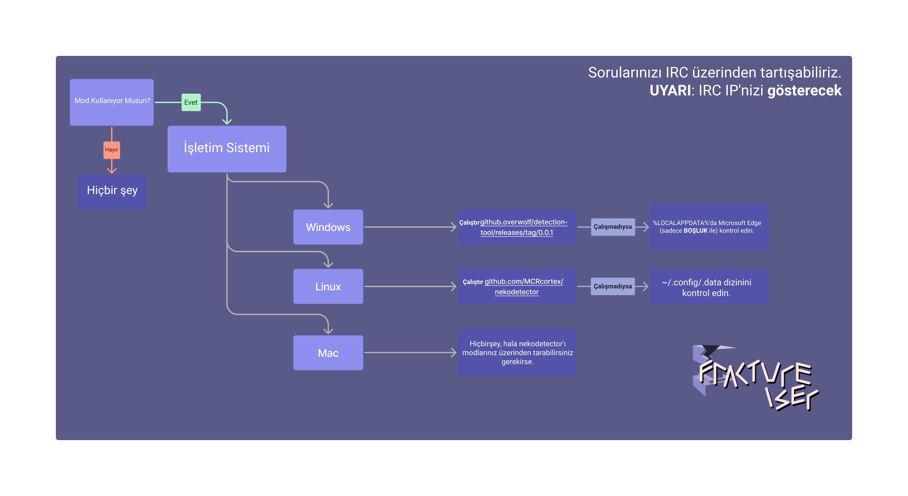
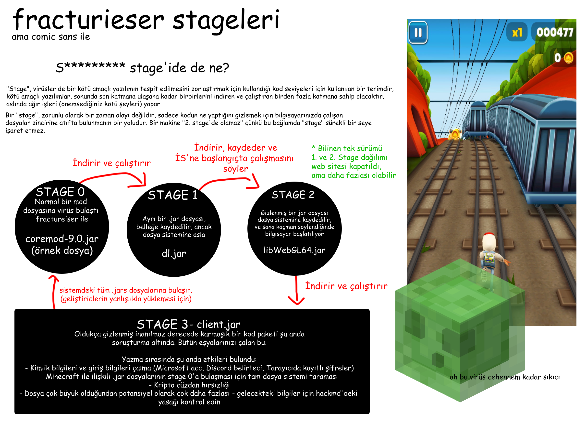

# Modlu Kullanıcılar İçin Rehber

Eğer **sadece** Minecraft'ı vanilla'nın ya da Prism'den oynuyorsanız ve modlara hiç dokunmadıysanız 100% güvenlisiniz. Şu anlık modlardan uzak durun.

Modlu Minecraft oyuncusuysanız, makinenizin ve kişisel verilerinizin risk altında olmadığından emin olmak için fractureiser 
kötü amaçlı yazılımı tarafından etkilendiğinizi doğrulamanız gerekmektedir. Aşağıdaki talimatlarla bunu yapabilirsiniz.

### Hala var mı??
**Hayır. yani, sanki**  
Şu anda, mevcut bilgilerimize göre, `fractureiser` virüsünün mevcut 
halka açık mod(paket)lerden tamamen temizlendiğine inanıyoruz.

Mevcut önerimiz, bu sayfadaki stage 2 denetleyicisini çalıştıran oyuncuların güvenli bir şekilde oynamaya devam edebileceğidir. 
Bununla birlikte, CurseForge ve Modrinth'te mod yüklemeleri tekrar çevrimiçi olduğundan, 
taklitçi kötü amaçlı yazılım yazarlarının yeni virüsler oluşturma potansiyeli bulunmaktadır.

Bu tür bir durumun gelecekte tekrar yaşanmaması için ilgili taraflarla iletişim halindeyiz ve protokollerin oluşturulması için çalışmalarımız devam etmektedir.

Oynamak istiyorsanız, lütfen bu sayfadaki teşhis adımlarını ve enfekte olup olmadığınıza dair izlemeyi içeren bölümleri geçirin.

### Page Structure
* [Ne Oldu?](#aslında-ne-oldu)
* [Enfekte miyim?](#enfekte-miyim)
* [Enfekteyim, Ne Olacak?](#enfekteyim-ne-olacak)
* [Enfekte değilim, Şimdi Ne Olacak?](#enfekte-değilim-şimdi-ne-olacak)
* [Sıkça Sorulan Sorular](#sıkça-sorulan-sorular)
* [Teknik SSS](#teknik-sss)

Fractureiser hakkında herhangi bir sorunuz varsa, lütfen bu sayfayı tamamen, en sonunda bulunan SSS bölümü de dahil olmak üzere okuyun, çünkü aldığımız çoğu sorunun cevabı burada verilmiştir.

## Aslında Ne Oldu?

Kötü niyetli bir şekilde görünmeyen birçok mod ve eklenti, kötü amaçlı yazılımın oluşturucusu tarafından başlangıçta mod barındırma web sitesi CurseForge ve eklenti hubı dev.craftbukkit.org'a (Bukkit yazılımı kendisi değil) yüklenmiştir. Tanınmış bir mod paketi geliştiricisi, denemek amacıyla bu modlardan birini indirdi ve bilgisi dışında bilgisayarındaki dosyaları enfekte etti - bu, virüsü içeren, görünüşte geçerli bir dosya olarak CurseForge'a yüklenmek üzere bir çalışma projesinin bir kopyasını içeriyordu.

Bu süreç, CurseForge ve dev.craftbukkit.org'daki kullanıcıların birkaç diğer vakası için tekrarlandı ve birkaç popüler eklenti ve modun kopyaları enfekte edildi. *Nisan ayının ortalarından itibaren kötü niyetli eklenti ve mod jarlarıyla ilgili raporlar bulunmaktadır.*

Buna ek olarak, CurseForge'da yüksek trafikli içerik oluşturucu hesaplarına kötü amaçlı yazılım yazarı tarafından brute force erişim girişimleri yapılmıştır. Şu anda, güvenlik ihlalinin brute force girişimi mi yoksa hesap sahiplerinin truva atı enfeksiyonu mu nedeniyle olduğu konusunda emin değiliz.

Bu kötü amaçlı yazılım, birden fazla "stage'den" oluşur ve her bir Stage bir sonrakini indirme ve çalıştırma sorumluluğuna sahiptir. Toplamda, bilinen üç Stage(Stage 1, 2 ve 3) bulunmaktadır ve enfekte mod dosyaları, tüm süreci başlatmak için bir "Stage 0" olarak görev yapar.

Stage 3, kötü amaçlı yazılımın "ustalık" stage'idir ve aşağıdaki tüm işlemleri gerçekleştirmeye çalıştığına dair kanıtlarımız vardır:

* Dosya sistemindeki *tüm* `jar` dosyalarına yayılmak ve muhtemelen CurseForge veya BukkitDev'den indirilmemiş modları veya diğer Java programlarını enfekte etmek
* Birçok web tarayıcısı için çerezleri ve giriş bilgilerini çalmak
* Panodaki kripto para adreslerini, saldırganın muhtemelen sahip olduğu alternatif adreslerle değiştirmek
* Discord kimlik bilgilerini çalmak
* Microsoft ve Minecraft kimlik bilgilerini çalmak

(Daha fazla bilgi için[teknik detaylara](tech.md) göz atın)

Bu davranışına dayanarak, bu saldırının modlu Minecraft ekosistemi üzerinde **hedefli bir saldırı** olduğuna **çok eminiz**. Durum oldukça ciddi.

**Daha fazla bilgi verilene kadar, Minecraft mod indirme konusunda aşırı dikkatli olun, kaynağı ne olursa olsun.** 
Bu kötü amaçlı yazılımın kontrol sunucusu şu anda çevrimdışı olsa da, 
son 2-3 haftada Curseforge veya Bukkit eklenti deposundan indirilen herhangi bir dosya potansiyel olarak zararlı olarak kabul edilmelidir. 
Bazı kötü amaçlı yazılım tarayıcıları veritabanlarına imzalar eklemeye başlamış olsa da, 
bu imzaların tüm tarayıcılara dağıtılması tamamlanana kadar lütfen dikkatli olun.

*Bu durumda herhangi bir barındırma hizmetinin etkilenmediğini iddia etmek konusunda emin olamayız*. Kullandığınız site ne olursa olsun dikkatli olmanız önemlidir. Maven depoları bile enfekte olmuş olabilir ve bu kötü amaçlı yazılım aylar öncesine kadar uzanır.

Şu anda yeni enfeksiyonlar imkansızdır çünkü saldırganın sunucusu kapatılmıştır, ancak mevcut enfeksiyonlar hala aktif olabilir.

<!--### Bu noktaya gel, nasıl düzelteceğim?

-->

### Dur, s********* "stage"i de ne?



## Enfekte miyim?

Kötü amaçlı yazılımın birden fazla stage'i olduğu için aslında enfekte olup olmadığınızı sormak aslında iki sorudan oluşur.

### Herhangi mod dosyam Stage 0'ı içeriyor mu?
Mod dosyasını alıp kötü amaçlı yazılımın Stage 0 tarafından enfekte olup olmadığını 
tespit eden çeşitli tarayıcılar mevcuttur.

* Overwolf'un [tarayıcısı](https://github.com/overwolf/jar-infection-scanner/releases)
* Oyununuzu kontrol etmek için önerilen seçenek - sadece CurseForge kurulum klasörünüze veya başka bir yerde sakladığınız klasöre işaret edin.
   * Bu bağımsız bir programdır ve Overwolf uygulamasının kurulu olmasını gerektirmez.
* douira'nın [web tabanlı çevrimiçi tarayıcısı](https://douira.github.io/fractureiser-web-detector/)
* cortex'in [nekodetector](https://github.com/MCRcortex/nekodetector/releases) 
   * Çalıştırılabilir dosyayı göstermek için "Assets" üzerine tıklayın - Java'nın yüklü olması gerekmektedir.

İzolasyonda, Stage 0 enfeksiyonu, dosyalar silinip hiç çalıştırılmazsa tehlikeli olmaz.

### Stage 2 benim sistemimde neyi temsil ediyor?

Stage 2 dosyalarının sisteminizde bulunması, kötü amaçlı yazılımın Stage 0 ve 1'inin başarıyla çalıştığı anlamına gelir. Eğer bu dosyalar mevcutsa, büyük olasılıkla *tamamen enfekte* olmuşsunuz demektir ve belgedeki talimatları okumaya devam etmelisiniz.

Birçok virüs tarayıcısı Stage 2 dosyalarını tespit etmeye başlamaktadır. Bu tür dosyaların bulunduğu ve kaldırıldığına dair bir uyarı alırsanız, "Enfekte Oldum, Şimdi Ne Yapmalıyım?" bölümüne geçiniz.

Aksi takdirde, platformunuza bağlı olarak aşağıdaki adımları manuel olarak kontrol edebilirsiniz:

#### Windows Talimatları

* Windows tuşuyla Başlat menünüzü açın ve `%localappdata%` yazın - aşağıdaki gibi görünmelidir:


* Local AppData klasörü içinde, Windows Gezgini'nin hem "Gizli Öğeleri" hem de "Korunan İşletim Sistemine Ait Dosyaları" görüntülemesi sağlanmalıdır.
   * Bu, Görünüm > Seçenekler üzerinden yapılabilir.
   * Bunu nasıl yapacağınızdan emin değilseniz, [şu video açıklamasından](https://youtu.be/KLTlTlnXeKs) yararlanabilirsiniz.
   * Windows 11 kullanıcıları aynı seçeneklere "Görünüm" düğmesinin üst bölümünde ve sağ taraftaki "..." düğmesinde ulaşabilirler.

* `Microsoft Edge` adlı bir klasörü bulun. "Microsoft" ve "Edge" arasındaki BOŞLUK önemlidir; çünkü `MicrosoftEdge`, Edge tarafından kullanılan meşru bir klasördür. Virüs sadece kendini gizlemek için bu şekilde adlandırmıştır.
   * Meşru klasör ayrıca `Microsoft\Edge` (Microsoft klasörü içindeki Edge klasörü) olarak da adlandırılabilir.
   * Meşru klasörün *olması gerekmez* - Edge ile ilgili hiçbir klasörünüz yoksa güvendesiniz demektir.
   * Her iki meşru klasör aynı anda var olabilir, bu da normaldir.

* `Microsoft Edge` mevcutsa, enfekte olmuşsunuz demektir. Bu durumda, klasörü ve içindekileri kalıcı olarak silin.
   * Klasör silinemiyorsa, görev yöneticiniz aracılığıyla şu anda çalışan tüm Java programlarını durdurmanız gerekmektedir.

#### MacOS Bilgisi

Malware MacOS'u etkilemiyor gibi görünüyor, bu yüzden sorun yaşamayacaksınız. 
*Ancak yine de arada bir buraya geri dönüp kontrol etmenizde fayda var.*

#### Linux Talimatları

Öncelikle, dosya listelemek için kullandığınız yöntemin gizli dosyaları görüntüleme özelliğine sahip olduğundan emin olun.

Çoğu grafiksel kullanıcı arayüzü dosya yöneticisi, gizli dosyaları açıp kapamak için Ctrl+H kısayolunu kullanır. Eğer bir terminal üzerinde yapıyorsanız, ilgili dizinlerde gizli dosyaları görüntülemek için `ls -A` komutunu kullanabilirsiniz. Daha ayrıntılı bir liste için `ls -lha` komutunu kullanabilirsiniz.
Eğer aşağıdaki dosyalardan herhangi biri mevcutsa, enfekte olmuşsunuz demektir. Bu durumda, hepsini silin:
* `~/.config/systemd/user/systemd-utility.service`
* `/etc/systemd/system/systemd-utility.service`
* `~/.config/.data/lib.jar`
Bunu yaptıktan sonra, varsa `journalctl` komutuyla tanımadığınız herhangi bir değişikliği kontrol edebilirsiniz. Sistem günlükleri için `journalctl -exb` komutunu (kullanıcı günlükleri için `journalctl -exb --user`) kullanabilirsiniz. Systemd hizmetlerinizi yenilemek için aşağıdaki komutları çalıştırın:
```sh
sudo systemctl daemon-reload # Kullanıcı şifrenizi girin
systemctl --user daemon-reload 
```

#### Betikler

*Eğer PowerShell veya Bash komut dosyası nasıl çalıştırılacağını bilmiyorsanız, bu size yönelik değildir.*
Ayrıca, Stage 2'yi kontrol etmek için otomatik PowerShell veya Bash komut dosyaları PrismLauncher
web sitesinde de mevcuttur. Eğer teknik bilgiye sahipseniz, bunları çalıştırmak için kullanabilirsiniz. 
Overwolf (Curseforge'un ana şirketi) ayrıca bir C# Stage 2 tespit aracı yayınlamıştır:
https://github.com/overwolf/detection-tool

## Enfekteyim, Ne Olacak?

**ÖNEMLİ**: Şu anda bu yazılımın tam olarak ne yapabileceğini veya niyetinin ne olduğunu bilmiyoruz, bu yüzden tam bir çözüm yolu bulunana kadar aşırı dikkatli olunmalıdır. Burada belirtilenler sadece *bildiğimiz* şeylerdir - eğer önemli bir şey bulunursa, takımın iletişimini güncellemek için haberleri takip etmeniz önemlidir.

Eğer sistemde fractureiser'a ait stage 2 dosyalarını bulursanız, stage 3 kodunun çalıştığını ve bilgisayarınızın enfekte olduğunu düşünmek oldukça muhtemeldir. Şimdi en iyi seçeneğiniz, o sistemin *tamamen tehlikede* olduğunu varsaymaktır. Aşağıdaki adımları takip etmelisiniz:

* Kaybetmek istemediğiniz her şeyi bir flash sürücü veya harici diske yedekleyin (zaten düzenli olarak yapmanız gereken bir işlemdir!).
* Ayrı bir cihaz kullanarak, eski makinede oturum açtığınız tüm hizmetlerin şifrelerini değiştirin (Discord, e-posta vb.). Mümkünse [BitWarden](https://bitwarden.com) gibi bir parola yöneticisi kullanın.
* Eğer henüz Herkese Açık Kimlik Doğrulama (Authenticator uygulaması veya SMS) kullanmıyorsanız, desteklediği her hizmet için derhal kullanmaya başlayın.
* Mümkünse, bölgenizde profesyonel bir hizmetle iletişime geçerek bilgisayarınızdaki şüpheli herhangi bir durumu teşhis ettirin veya güvenli bir varsayılan olarak sistemi sıfırlayıp yeniden kurun.
* Aşağıdaki "Eğer enfekte değilseniz ne yapmalısınız" bölümünü okuyun, çünkü oradaki adımlar sizin için de geçerlidir.

## Enfekte değilim, Şindi Ne Olacak?

Eğer stage 2 tespit aracı tarafından herhangi bir şey bulunmadıysa, muhtemelen bir sorun olmadığı ve oyun oynamak için güvende olduğunuz anlamına gelir.

`fractureiser` temizlendiği halde, yeni virüsler yakın gelecekte ortaya çıkabilir, bu yüzden yeni protokoller oluşturulana kadar dikkatli olmanızı öneririz. Oyun oynamak isterseniz:

* Yalnızca daha önceden indirdiğiniz ve güvenli olduğunu doğruladığınız modları ve mod paketlerini kullanın.
* 8 Haziran'dan sonra yeni veya bilinmeyen yazarlardan yüklenen herhangi bir şeyi indirmekten kaçının, önceki maddeye verilen nedenle.
* Mod(paket)lerinizi güncellemekten kaçının.
* Takımın iletişiminden gelecekte böyle sorunları tespit etmek için yeni yöntemlerle ilgili gelişmeleri takip edin.

## Sıkça Sorulan Sorular

### CurseForge hacklendi mi?
CurseForge kendisi kompromize edilmemiştir, sadece bireysel kullanıcılar etkilenmiştir. Bu bir CurseForge sorunu değildir, sadece bu olayın meydana geldiği yerdir. CurseForge, [makale](https://support.curseforge.com/en/support/solutions/articles/9000228509-june-2023-infected-mods-detection-tool/) yayınlamış ve durumu kendi açılarından açıklamıştır. Ayrıca karşı önlemler almaya çalışmaktadırlar.

### Modrinth sağlam mı?
Modrinth son 10 ay boyunca yapılan tüm yüklemelerin tam taramasını gerçekleştirdi ve herhangi bir enfekte projeye rastlanmadı. 
Şu anda herhangi bir modla ilgili bir şey indirirken aşırı dikkatli olmanızı hala öneriyoruz. 
Modrinth'te modların enfekte olmaması tamamen bir şans eseridir.

### Modrinth daha mı güvenli?
Bu bir web sitesi-düzeyinde bir sorun değildir, Modrinth de CurseForge kadar güvenlidir.

### CurseForge bunun geçmesine nasıl izin verdi?
Stage 0 enfeksiyonunun çalıştırdığı kod, otomatik bir sistem için şüpheli olması gerekmezdi ve başka bir mod tarafından kullanılmış olabilir. 
Aslında, stage 0 enfeksiyonunu belirlemek için yapılan erken sezgisel analizler, Quark gibi popüler modlarda önemli miktarda yanlış uyarı veriyordu.

Gerçekçi olarak, böyle bir önlemin platform ölçeğinde uygulanması mümkün değildir çünkü niyeti gizlemek için kodun düzenlenebileceği sonsuz farklı yöntem bulunmaktadır.

### Hangi anti-virüsler bunu yakalıyor?
Şu anda konuştuğumuz sırada yeni olanlar ekleniyor, şimdilik AV'ye güvenmek yerine manuel doğrulamayı yapmak en iyisidir.

### Çok-Oyunculu güvenli mi?
Evet, başka bir yerden mod indirmezseniz, çok oyunculu bir sunucu aracılığıyla enfekte olamazsınız.

### Bedrock güvenli mi?
Evet, bu sadece Java'yı etkiliyor.

### Alternatif oyun istemcileri olan Lunar veya Badlion gibi platformlar güvenli mi?
Aşağıya göz atın.

### Optifine güvenli mi? / Sodium güvenli mi? / Iris güvenli mi? / Create güvenli mi? / Essential güvenli mi? / (Mod yerleştirin) güvenli mi?

**Şu an hiçbir modun güvenliğini garanti edemeyiz.**

Virüsün stage3 işlevlerinden biri, bilgisayarınızdaki mümkün olduğunca çok .jar dosyasını enfekte etmektir. Bu, Minecraft'in kendisi (vanilya/modlu), Minecraft modları, Spigot eklentileri ve ilişkisiz Java uygulamaları dahil olmak üzere **tüm `.jar` dosyalarını** enfekte edebilir. Dolayısıyla, bilgisayarınızda virüsün stage3 bölümü bulunuyorsa, indirdiğiniz bir modun "güvenli" olup olmadığı önemli değildir - o mod *enfekte olacaktır*. Fractureiser'ın sonraki stagelerini tespit edin ve kaldırın.

Şu anda, CurseForge'da bilinen tüm enfekte modlar kaldırılmıştır. CurseForge, [bilinen enfekte modların bir listesini](https://support.curseforge.com/en/support/solutions/articles/9000228509-june-2023-infected-mods-detection-tool/) (sayfanın altında) yayınlamış ve bunları web sitesinden kaldırmıştır. Modrinth, son 10 ayı taradı ve enfekte mod bulunamadı.

Bu, gizlice aradan sıyrılanların olmadığını *garanti etmez*. Bir jar dosyasının fractureiser'ın stage0'ını içerip içermediğini kontrol etmek için, şu an için modlarla ilgili herhangi bir şeyi indirirken genel olarak dikkatli olmak için [Enfekte Miyim?](#enfekte-miyim) bölümünü kontrol edin ve son derece dikkatli olun.

### Enfeksyon ne kadar yaygın?

CurseForge, enfeksiyon dönemi boyunca yaklaşık 6.000 kez enfekte dosyaların indirildiğini bildirmektedir. CF'un Discord duyurusundan alıntı yapacak olursak:
> Perspektif sağlamak için, bu, CurseForge'un Minecraft için günlük indirmelerinin yaklaşık %0,015'ine denk gelmektedir.

### Birisi 1.20 olayını bozmak mı istedi?

Bu, bir tesadüf gibi görünüyor. Bu kötü amaçlı yazılım kampanyası, 1.20 sürümünün yayınlandığı sabah geniş çapta ortaya çıkmadan önce uzun bir süredir aktifti.

## Teknik SSS

### Fractureiser SM(Sanal Makine)'lerden kaçabiliyor mu?

**Hayır.**

["Windows Sandbox"](https://learn.microsoft.com/en-us/windows/security/application-security/application-isolation/windows-sandbox/windows-sandbox-overview)içerisinden *manuel* bir kaçış *denemesi* için stage3'de kod bulunmaktadır. Bu otomatik olarak gerçekleşmez. Eğer virüs Windows Sandbox'tan çalıştırılırsa, panoyu etkilemeye çalışarak sizi malware'ın kısayolunu yapıştırmaya kandırmaya çalışacaktır.

Bu tür "pano kaçışı" yöntemleri yeni değildir ve panoyu ana işletim sistemi ile konuk işletim sistemi arasında paylaşmayarak kolayca engellenebilir. "Windows Sandbox" gibi daha ağır bir sanal makine kullanın ve VirtualBox'un "Guest Addons" veya Hyper-V'nin "integration services" gibi özelliklerini devre dışı bırakın.

(*Gerçek* sanal makine kaçışı zafiyetleri milyonlarca dolara değer taşır ve bunlar Minecraft çocuklarına harcanacak kadar basit bir şekilde kullanılmaz. Ayrıca, malware'ın yazarının başarılı bir programcı olmadığına dair nedenlerimiz bulunmaktadır.)

### Ağ'ı yaymaya çalışıyor mu?

Bildiğimiz kadarıyla, fractureiser ağı yayma işlevselliği içermemektedir, ancak tamamen mümkün değildir. Çalıştığımız bir güvenlik araştırmacısı bir uyarı aldı, ancak bu tamamen ilgisiz bir kötü amaçlı yazılım ile ilgiliydi ve tesadüfen benzer bir dosya adı kullanıyordu. Bu sadece yanlış bir alarmdı.

### CurseForge ve Modrinth bu konu hakkında ne yapıyor?

CurseForge, açık kaynaklı bir [stage2/3 tespit aracı](https://github.com/overwolf/detection-tool) ve [stage0 tespit aracı](https://github.com/overwolf/jar-infection-scanner) geliştirmiştir. Tüm yüklenen modlar ve eklentiler stage0 enfeksiyonları için taranmış ve bilinen enfeksiyon vakaları silinmiştir.

Modrinth, son 10 ay boyunca yüklenen modları ve eklentileri stage0 enfeksiyonları için taradı ve herhangi bir enfeksiyon bulunmadı.

Her iki platform da mod gönderim sürecine bir tür otomatik "virüs taraması" süreci eklemeyi düşünmektedir. Bunun zor tarafı, bu tür Java tabanlı kötü amaçlı yazılımların genellikle özel olarak oluşturulmasıdır.

### Güvenlik duvarımda/yönlendirme tablomda hangi IP adreslerini ve URL'leri engellemeliyim?

Fractureiser ile ilgili kodların, geniş bir port numarası yelpazesinde aşağıdaki URL'ler ve adreslere bağlandığı gözlemlenmiştir.

* Stage0 enfekte modlarda sabitlenmiş adres ve ilk tespit edilen komut kontrol sunucusu: `85.217.144.130`
* İkinci tespit edilen komut kontrol sunucusu: `107.189.3.101`
* Stage1 tarafından kullanılmaya çalışılan yedek URL ve stage2 komut kontrol ana bilgisayar adı: `files-8ie.pages.dev`

Ayrıca, kötü amaçlı yazılımın eski bir sürümünden kaynaklanabilecek bilinmeyen nedenlerle `v2202209151437200088` 
ana bilgisayar adına 25575 portu üzerinden bağlanma girişimlerine dair kanıtlar da bulunmaktadır.

Aşağıda, skyrage ile ilgili güvenlik duvarına eklenmesi gereken bazı adresler bulunmaktadır (tekrar belirtmek gerekirse, *çok* muhtemeldir ki skyrage bu vektör aracılığıyla hiç kimsenin bilgisayarına indirilmemiştir, ancak bu adreslerden hiçbir şey iyi gelmez):

* `95.214.27.172`
* `connect.skyrage.de`
* `t23e7v6uz8idz87ehugwq.skyrage.de`
* `qw3e1ee12e9hzheu9h1912hew1sh12uw9.skyrage.de`
* *Muhtemelen sadece `skyrage.de`'nin tamamını engelleyin*

Bu adreslere kesinlikle ziyaret etmemeniz gerektiğini söylemeye gerek olmadığını düşünüyorum.

### Modunuzun diğer dosyaları indirmesini CurseForge/Modrinth kurallarına aykırı hale getirebilir miyiz?

CurseForge'da zaten kötü amaçlı yazılım yüklemek yasak. Bu tür engellemelerin, bu durumda bir modun dosya indirmesi için birçok meşru kullanım durumu da engelleyeceği unutulmamalıdır.

### Mod yükleyicinin kendisine bir tür "antivirüs" veya "korumalı alan" eklemek mümkün müdür?

"Antivirüs": Muhtemelen, normal antivirüslerin algılayamamasının aynı nedenlerinden dolayı etkili olmayacaktır. Antivirüsler yalnızca bilinen kötü amaçlı yazılımları algılayabilir, bilinmeyen kötü amaçlı yazılımları değil.

Kum Sandığı (Sandbox): Bir sınıfın yüklenmeden önce "bu sınıf 'güvenli' kod içeriyor mu?" gibi bir kontrolün yapılması, kötü amaçlı yazılım geliştiricileri ile mod yükleyici geliştiricileri arasında bir kedi-fare oyununu tetiklemek için harika bir yöntemdir.

Bir Java kodunun belirli bir sınıfın (örneğin, `URLClassLoader`) kullanımını yasaklamak oldukça zordur çünkü aynı sınıfa `Class.forName` ile de referans verebilirsiniz (bu durumda birçok meşru kullanım durumu bulunur). Eğer bunları yasaklarsanız veya engellersek, genellikle sınıf yolu üzerinde `Class.forName` çağrısı yapacak başka bir şey bulabilirsiniz ve bu "araçlar"ı ortadan kaldırmaya çalışmak bitmek bilmeyen bir fare yakalama oyununa dönüşebilir.

Java'nın sandbox'a alınması neredeyse imkansızdır - ["Twenty Years of Escaping the Java Sandbox"](https://www.exploit-db.com/papers/45517) gibi makalelere bakabilirsiniz.

Java modları basitçe rastgele bir kod paketidir: onları bir `.exe` dosyası gibi ele alın, herhangi bir şey yapabilirler.

### Kötü amaçlı yazılımların onları kurcalamasını önlemek için neden modlar kriptografik olarak imzalanmıyor?

Sorunun bir kısmı, imzaların yalnız başına kötü amaçlı yazılımları önlememesidir - kriptografik olarak imzalanmış bir virüs hala bir virüstür. Ayrıca, kendi kendini imzalama izni verilse bile, bu da müdahaleyi önlemez - bir virüsün basitçe bir JAR dosyasından dijital imzaları kaldırması ("META-INF" klasörünü silerek) ve kendi anahtarını kullanarak yeniden imzalaması mümkündür. (Bu bir hipotez değildir, fractureiser enfekte ettiği JAR dosyalarından dijital imzaları kaldırmak için kod içerir.)

Çevrimiçi imza doğrulaması ile imzalı modlar, ilerlemek için umut verici bir yöntem gibi görünse de, bazı trade-off'lar da beraberinde gelmektedir. Modlama ekosisteminden birçok farklı temsilcinin katılacağı [bir toplantıda](2023-06-08-meeting.md) yapılacak ve nasıl ilerleneceği konusunda tartışmalar gerçekleştirilecektir.

### Modların yürütülebilir kod indirmesini yasaklamak mümkün mü?

Bu doğru değil. Bir dosyanın indirilmeden önce içinde yürütülebilir kod bulunup bulunmadığını bilemezsiniz ve bir dosya indirildikten sonra ne yapıldığını kontrol edemezsiniz.

* Modum bir Java sınıf dosyası indiriyorsa ne olacak?
* Önce bir Java sınıf dosyası gibi görünmeyen, ancak aslında tersten yazılmış bir Java sınıf dosyası ne olacak?
* Şifrelenmiş bir Java sınıf dosyası ne olacak?
* Bilgisayarınızda derlenen Java *kaynak* kodu ne olacak?
* Bir Python betiği ne olacak?
* Kelime sayısı çift olan cümlelerin 0'a, tek olan cümlelerin ise 1'e denk geldiği İngilizce bir yazı içeren bir dosya ne olacak? - Proz bir belge olsa bile, istediğim takdirde onu bir `.exe`'ye yeniden birleştirebilirim.

Bu örneklerde, dosyanın içeriğini gerçek anlamda değerlendirmek ve ne tür bir dosya olduğunu kesin olarak belirlemek oldukça zor olacaktır. Dolayısıyla, dosyanın indirilmesinden sonra ne yapılacağını kontrol etmek veya içeriğini tam olarak analiz etmek mümkün değildir.

### Bu, etrafta dolaşan Spigot eklentisi kötü amaçlı yazılımıyla mı ilgili?

Muhtemelen! 
Mevcut "skyrage" kötü amaçlı yazılımla ilgili bazı bağlantılar var - malware yazarı, saldırıyı genişletmek için başarısız bir şekilde yedek komut ve kontrol sunucusuna skyrage ile ilgili bir `.jar` yükledi. Ancak CloudFlare tarafından zaten engellendi.

**Bu vektör üzerinden Skyrage ile enfekte olan herhangi bir kişiye dair rapor almadık.** Yazar, stage0-enfekte modlardaki sabit IP adresi alındıktan uzun bir süre sonra CloudFlare URL'sini Skyrage'e yönlendirmeyi güncelledi. Genel olarak, saldırganın bu jar'ı sunmayı denemesi komik bir merak nesnesidir.

skyrage, mevcut, iyi incelenmiş bir kötü amaçlı yazılımdır ve onunla ilgili daha fazla bilgiyi [buradan](https://ljskatt.no/analysis/updater_class/) bulabilirsiniz.