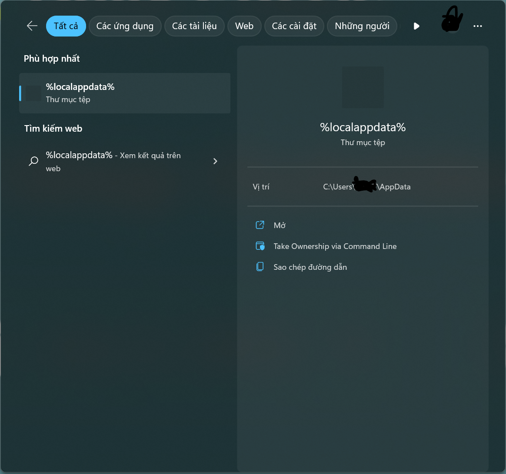

# Hướng dẫn cho những người chơi với mod

Nếu bạn chỉ chơi với Minecraft bình thường từ một chương trình tạo ra để trình chạy Minecraft, 
như chương trình chạy Minecraft chính hãng của Mojang, hoặc Prism, và bạn chưa bao giờ dùng mod: bạn 100% an toàn. 
Hãy tạm thời tránh xa ra từ các chương trình mod cho Minecraft.

Nếu bạn là một người chơi mod cho Minecraft, bạn cần phải xác minh rằng bạn không bị nhiễm trùng vi rút fractureiser 
để đảm bảo an toàn máy tình và thông tin cá nhân của bạn không có nguy cơ bị mất. Bạn có thể kiểm tra bằng các hướng dẫn sau.

### Hiện tại, cái vi rút này vẫn có chạy không?
**Không. Nhưng mà một phần là có**  

Hiện tại, với thông tin chúng tôi có, chúng tôi nghĩ rằng vi rút `fractureiser` đã bị xóa đi từ tất cả các mod công khai hiện tại.

Chúng tôi hiện tại khuyên rằng tất cả người chơi mà đã kiểm tra cho giai đoạn2 với các bước chứa trong trang này, 
có thể chơi tiếp mà vẫn sẽ an toàn, nhưng mà tại vì tính năng đăng nhập mod đã được bật lại cho các 
trang CurseForge và Modrinth, một người khác có thể đăng lại một vi rút mới.

Chúng tôi đang liên lạc các đơn vị cần thiết để thành lập quyết nghị để tình huống như thế này không thể xảy ra trong tương lai.


Nếu bạn muốn chơi với mod, xin vui lòng bạn theo những bước chẩn đoán trên trang này 
và những phần sau để xem bạn cần làm gì nếu bạn không hoặc có bị nhiễm.

### Kiến trúc của trang này
* [Việc gì xảy ra?](#việc-gì-xảy-ra)
* [Tôi có bị nhiễm không?](#tôi-có-bị-nhiễm-không)
* [Tôi bị nhiễm, bây giờ làm gì?](#tôi-bị-nhiễm-bây-giờ-làm-gì)
* [Tôi không bị nhiễm, bây giò làm gì?](#tôi-không-bị-nhiễm-bây-giờ-làm-gì)
* [Câu hỏi thường gặp](#câu-hỏi-thường-gặp)
* [Câu hỏi kỹ thuật thường gặp](#câu-hỏi-kỹ-thuật-thường-gặp)

Nếu bạn vẫn có câu hỏi về vi rút fractureiser, vui lòng đọc tất cả trang này, cộng thêm phần "Câu hỏi thường gặp" ở cuối trang, 
tại vì phần lớn câu hỏi chúng tôi đang nhận đã được trả lời ở đây.

## Chuyện gì đã xảy ra?

Một số mod và phần mềm plugin nhìn như vô tội đã được đăng lên bởi người tạo ra vi rút đến website của CurseForge và nơi đăng 
plugin dev.bukkit.org (không phải nơi có phần mềm Bukkit). Một người lập trình mod phổ biến tải xuống một trong nhũng cái mod 
này để dùng thử, từ đó cái mod đã nhiễm tệp trên máy của họ mà họ không biết - một trong những tệp đó là một phiên 
bản của một mod đang được lập trình mà lúc sau sẽ đăng lên CurseForge như một mod thật sự, với vi rút ở trong.

Quá trình này lặp lại cho một số mod khác của người dùng CurseForge và dev.bukkit.org, làm nhiễm một phiên bản của một số 
plugin và mod phổ biến. *Có một số báo cáo về mod/plugin bị nhiễm từ giửa thánh tư (4).*

Cùng lúc này, các tài khoản CurseForge của những người lập trình mod mà thường nhận rất nhiều lượt xem đang bị tấn công bởi người 
viết vi rút. Chúng tôi không biết rằng sự cố này là do lượt tấn công của người viết vi rút hay là nhiễm vi rút lừa đảo trên 
máy tình của chủ tài khoản.

Vi rút này có một số "giai đoạn", mỗi giai đoạn chịu trách nhiệm về việc tải xuống và chạy giai đoạn tiếp theo. Có tổng cộng 3 giai 
đoạn (Giai đoạn 1, 2, và 3), và các mod bị nhiễm làm "giai đoạn 0" để bắt đầu quá trình.

Giai đoạn 3 là phần "não" của vi rút này, và chúng tôi có bằng chứng rằng vi rút này cố gắng để chạy tất cả những thứ sau:
* Tự tuyên truyền chính nó đến *tất cả* tệp có đuôi .jar trên hệ thống, nên có thể làm nhiễm nhưng mod không tải xuống 
từ CurseForge hoặc BukkitDev (dev.bukkit.org), hoặc các chương trình Java khác.
* Sao chép cookie và thông tin đăng nhập lưu trong nhiều chương trình duyệt web.
* Thay địa chỉ crypto đã sao chép với địa chỉ crypto khác, người chủ của các địa chỉ này có thể là người tấn công.
* Lấy thông tin trong tài khoản Discord của bạn
* Lấy thông tin trong tài khoản Microsoft và tài khoản Minecraft của bạn

Hãy xem [phân tích kỹ thuật](./docs/tech.md) để tìm hiểu thêm (Tiếng Anh)

Bởi các hành vi của vi rút này, chúng tôi **rất tự tin** rằng là đây là một **sự tấn công có chủ đích là tấn công các người dùng và 
người lập trình các mod cho Minecraft**. Nó rất tệ.

**Cho đến khi chúng ta có thông báo mới, hãy cẩn thận khi tải xuống mod cho Minecraft, từ nơi tải nào hết. ** Cho dù máy chủ điều khiển 
dùng cho vi rút này đang hiện tại đã tắt, **tất cả các tệp tải xuống từ CurseForge hoặc dev.bukkit.org cách đây 2-3 tuần nên coi như 
là bị nhiễm**. Một số chương trình quét vi rút đang bắt đầu thêm những chữ kí dùng cho vi rút này vào các cơ sở dữ liệu của họ, nhưng cho
đến khi tất cả chương trình quét đã thêm vào, hãy cẩn thận.

*Cho đến hiện tại, chúng tôi không tự tin nói rằng một nơi đăng mod không bị ảnh hưởng*. Vui lòng bạn cẩn thận với bất cứ trang web nào 
bạn dùng. Cả các kho lưu trữ phần mềm Maven có thể bị nhiễm, và vi rút này đã xinh tồn cho mấy thánh rồi.

Trong thời điểm hiện tại, không ai có thể mới bị nhiễm trùng tại vì máy chủ của người tấn công đã bị tắt, nhưng những lượt nhiễm trùng 
vi rút đã có sẵn trước khi máy chủ bị tắt có thể vẫn còn chạy.

<!--### Làm sao tôi có thể xóa được? (Tiếng Anh)

-->

### Khoan, một "giai đoạn" là cái gì??? (Tiếng Anh)


## Tôi có bị nhiễm không?

Vi rút này có nhiều giai đoạn, nên nếu bạn đang hỏi rằng bạn có bi nhiễm không, bạn đang hỏi 2 câu.

### Có tệp nào của tôi chứa Giai đoạn 0?
Có một số chương trình quét được một tệp mod và xá định nếu tệp đấy bị nhiễm phần Giai đoạn 0.

* [Chương trình quét của Overwolf](https://github.com/overwolf/jar-infection-scanner/releases)
	* Cách này bạn nên làm nếu bạn muốn kiểm tra cả chương trình chơi của bạn - chỉ cần cho nó quét vào nơi cài đặt CurseForge hoặc 
	chỗ khác bạn có tệp dùng cho trò chơi. 
	* Bạn không cần có ứng dụng Overwolf để dùng; ứng dụng này có thể tải riêng.
* [Máy quét qua mạng của douira](https://douira.github.io/fractureiser-web-detector/)
* [nekodetector, tạo ra bởi cortex](https://github.com/MCRcortex/nekodetector/releases)
	* Ấn nút "Assets" để thấy được tệp cần chạy - ứng dụng này cần có Java đã cài đặt.

Tệp chứa Giai đoạn 0 sẽ không nguy hiểm nếu tệp bị nhiễm đã được xóa đi và không bao giờ chạy.

### Máy tính của tôi có chứa tệp dùng cho Giai đoạn 2?

Tệp dùng cho Giai đoạn 2 trên máy của bạn có nghĩa rằng Giai đoạn 0 và 1 của vi rút đã chạy thành công. Nếu bất cứ tệp nào dùng cho 
Giai đoạn 2 có trên máy của bạn, xáp xuất rất cao là bạn hoàn tòan bị nhiễm và bạn nên đọc tiếp các hướng dẫn trong tài liệu này.

Nhiều chương trình quét vi rút đang bắt đầu phát hiện các tệp dùng cho Giai đoạn 2. Nếu bạn nhận một thông báo ghi rằng các tệp đã bị 
phát hiện và xóa đi, hãy đến phần ["Tôi bị nhiễm, bây giờ làm dì?"](#tôi-bị-nhiễm-bây-giờ-làm-gì).

Nếu không nhận được thông báo, bạn có thể kiểm tra bằng cách thủ công theo hệ điều hành của bạn:

#### Hướng dẫn cho người dùng Windows

* Mở màn hình Start với nút Windows, và đánh vào `%localappdata%` - nó sẽ nhìn như sau:


* Trong thư mục AppData/Local, bạn phải chắc chắn rằng chương trình Explorer của bạn đã đặt để xem cả
`Hidden Items`, và `Protected Operating System Files`.
  * Bạn có thể bật ở trong View > Options
  * Nếu bạn không biết cách làm, có một video hướng dẫn
[ở đây](https://youtu.be/KLTlTlnXeKs).
  * Windows 11 users can find the same options under the "View" button at the top ribbon, as 
  well as  the  "..." button on the rightmost side of it

* Locate a folder named `Microsoft Edge`. The SPACE between "Microsoft" and "Edge" is
  important - as `MicrosoftEdge` is a legitimate folder that is used by Edge.  The virus
  simply named it like that to disguise itself.  
  * The legitimate folder might also be called `Microsoft\Edge` (an `Edge` folder inside a 
`Microsoft` folder).
  * The legitimate folder doesn't *have* to exist - if you don't have any Edge related folders,
  you're safe.
  * Both legitimate folders can exist at the same time, this is okay too.
* If `Microsoft Edge` is present, you were infected. If this is the case, permanently delete the 
folder and everything inside it.
  * If the folder can not be deleted, you must stop any Java programs currently running via your 
Task Manager.

#### MacOS Information

The malware does not seem to affect MacOS, so you should be fine.  
*Check back here every now and then just in case.*

#### Linux Instructions

Firstly, ensure whichever method you are using to list files has the ability to view hidden files.
Most GUI file managers have the shortcut Ctrl+H to toggle hidden files. If doing this on a terminal, 
use `ls -A` in the respective directories, or `ls -lha` for a more detailed listing.

If any of the following files exist, you were infected. If this is the case, delete all of them:
* `~/.config/systemd/user/systemd-utility.service`
* `/etc/systemd/system/systemd-utility.service`
* `~/.config/.data/lib.jar`

Upon doing so, if applicable, check your `journalctl` for any changes you may not recognize. You
can do this with the commands `journalctl -exb` (for system logs) and `journalctl -exb --user` 
(for user logs). Run the following commands to refresh your systemd services:
```sh
sudo systemctl daemon-reload # Enter your user password
systemctl --user daemon-reload 
```

#### Scripts

*If you don't know how to run a PowerShell or Bash script, these are not for you.*  
Automated PowerShell or Bash scripts are also available [on the PrismLauncher
website](https://prismlauncher.org/news/cf-compromised-alert/#automated-script) to check
for Stage 2 for you, if you have the technical knowhow to run them. Overwolf (Curseforge's
parent company) has also released a C# Stage 2 detection tool:
https://github.com/overwolf/detection-tool

## I'm Infected, Now What?

**IMPORTANT**: We do not currently know the full extent of everything this can do, nor what its
intent is, so extreme caution should be exercised until a complete way to remove any symptoms is
found. Everything stated here is only *what we know* - please keep an eye on communication from the
team on updates if anything critical is found.

If you find stage 2 files from fractureiser on your system, it's very likely that the stage 3 code
has ran and infected your machine.  
Your best option now is to assume everything on that system is *entirely compromised*. You should:

* Back up anything you do not want to lose on an a flash drive or external disk (you should be
doing this regularly anyway!)
* Using a separate device, change the passwords to all services you were logged into on
  the old machine (Discord, email, etc.). Preferably using a password manager like
  [BitWarden](https://bitwarden.com).
* If you were not yet using Two-Factor Authentication (Authenticator app or SMS) for every service
that supports it, please start doing so immediately
* If you are able to, contact a professional service in your area to run a proper
  diagnostic on your machine for anything suspicious, or as a safe default simply wipe and
  reinstall the system.
* Read the below section on what to do if you're not infected, as the steps there apply to you too.

## I'm Not Infected, Now What?

If nothing was found by the stage 2 detector, chances are there's nothing going on and you're good
to play.

While `fractureiser` has been cleaned out, new viruses may appear in the near future until we 
establish new protocols. If you want to play the game, we recommend:

* Play exclusively mods and modpacks that you have already downloaded and verified safe.
* Avoid downloading anything uploaded after the 8th of June from new or unknown authors, for the
same reason as the previous point.
* Avoid updating your mod(pack)s.
* Keep an eye on communication from the team on developments regarding new methods to detect
issues like this in the future.

## Frequently Asked Questions

### Is CurseForge hacked?
CurseForge itself is not compromised, only individual users. This is not a CurseForge problem, they
just happened to the be place this happened in. CurseForge have also [posted an article](https://support.curseforge.com/en/support/solutions/articles/9000228509-june-2023-infected-mods-detection-tool/) describing the situation from their end and
are working on deploying countermeasures.

### Is Modrinth okay?
Modrinth has ran a full scan of the last 10 months of uploads and no infected projects were found. 
We still recommend exercising extreme caution when downloading anything mod related at the moment. 
The fact no mods were infected there was entirely luck.

### Is Modrinth safer?
This isn't a website-level issue, Modrinth is just as safe as CurseForge is.

### How did CurseForge let this slip through?
The code the stage 0 infection ran wasn't necessarily suspicious to an automated system, and could
very well have been something another mod would've used. In fact, early heuristics for determining
stage 0 infection had significant amounts of false flags on popular mods such as Quark.

Realistically, this type of prevention on a platform scale is non-feasible due to the infinite
different ways you can lay out code to hide your intent.

### Which Antiviruses catch this?
New ones are being added as we speak, it's best to do the manual verification above instead of
relying on AV for now.

### Is Multiplayer safe?
Yes, you can not be infected via a multiplayer server if you don't download mods for it elsewhere.

### Is Bedrock safe?
Yes, this affects only Java.

### Are alternative game clients such as Lunar or Badlion safe?
See the below point.

### Is Optifine safe? / Is Sodium safe? / Is Iris safe? / Is Create safe? / Is Essential safe? / Is (insert mod) safe?

**We can not currently fully confirm the safety of any given mod.**

One of the functions of stage3 of the virus is infecting as many .jars as it can find on your 
computer. It can infect **all `.jar`s**, including Minecraft itself (vanilla/modded), Minecraft 
mods, Spigot plugins, and unrelated Java applications. So if your computer has the stage3 portion 
of the virus, it doesn't matter whether a mod you download is "safe" - it will *become* infected. 
Detect and remove the later stages of fractureiser *first*.

At the moment, all *known* infected mods have been removed from CurseForge. CurseForge [posted a 
list of known infected mods](https://support.curseforge.com/en/support/solutions/articles/9000228509-june-2023-infected-mods-detection-tool/) (bottom
of the page) and has removed them from the website. Modrinth has scanned back 10 months and has not found any infected mods. 

This does *not guarantee no sneaky ones slipped through*. To check whether a given jar contains 
stage0 of fractureiser, check the [Am I Infected?](#am-i-infected) section and overall exercise
extreme caution downloading anything mod related for now.

### How widespread was the infection?

CurseForge is reporting infected files were downloaded roughly 6,000 times for the entire 
infection period. Quote from CF's Discord announcement: 
> Just to give perspective, this accounts to about 0.015% of CurseForge’s daily downloads 
> for Minecraft.

### Did someone want to spoil the 1.20 release event?

It appears to be a coincidence - this malware campaign was active for quite a while before being 
widely uncovered the morning-of the 1.20 release.

## Technical FAQ

### Can fractureiser escape VMs (Virtual Machines)?

**No.**

stage3 *does* contain code for *attempting* a *manual* escape from the 
["Windows Sandbox"](https://learn.microsoft.com/en-us/windows/security/application-security/application-isolation/windows-sandbox/windows-sandbox-overview).
It does not happen automatically. If the virus is ran from the Windows Sandbox, it will try to
mess with the clipboard to trick you into pasting a shortcut to the malware.

Note that this sort of "clipboard escape" is nothing new and it is very easy to defeat by simply
not sharing the clipboard between the host and guest OS. Use a more heavyweight virtual-machine
than the "Windows Sandbox", and disable features like VirtualBox's "Guest Addons" or Hyper-V's
"integration services".

(*Real* virtual-machine escape exploits are worth millions of dollars and would not be burned on
some Minecraft kids, and we have reason to believe the author of this malware is not a very good
programmer in the first place.)

### Does this spread over the network?

As far as we know, fractureiser does not contain network spread functionality, but it is not fully
out of the question.  
A security researcher we are working with got an alert, but it ended up being about completely 
unrelated malware that happened to use a similar filename. This was just a false alarm.

### What are CurseForge and Modrinth doing about it?

CurseForge has developed an open-source [stage2/3 detection tool](https://github.com/overwolf/detection-tool) 
and [stage0 detection tool](https://github.com/overwolf/jar-infection-scanner), have scanned *all* 
uploaded mods/plugins for stage0 infections, and have deleted all *known* infection cases.

Modrinth has also scanned uploaded mods/plugins for stage0 infections going back 10 months and did 
not find any.

Both platforms are considering introducing some sort of automated "virus scan" process to the mod 
submission pipeline. It's hard, since Java malware like this is typically bespoke.

### What IP addresses and URLs should I block in my firewall/routing table?

fractureiser-related code has been observed to connect to these URLs and addresses over a wide 
variety of port numbers.

* The hardcoded address in stage0-infected mods, and the first observed command&control 
server: `85.217.144.130`
* The second observed command&control server: `107.189.3.101`
* The fallback URL that stage1 tries to use, and the stage2 command&control hostname: 
`files-8ie.pages.dev`

There's also evidence of it trying to connect to the hostname `v2202209151437200088` 
over port 25575 - unknown reasons; probably from an older version of the malware.

Here are some additional addresses to firewall related to skyrage stuff (again, *very* unlikely 
skyrage was downloaded to anyone's PC through this vector, but nothing good comes from these 
addresses anyway):

* `95.214.27.172`
* `connect.skyrage.de`
* `t23e7v6uz8idz87ehugwq.skyrage.de`
* `qw3e1ee12e9hzheu9h1912hew1sh12uw9.skyrage.de`
* *Probably just block all of `skyrage.de` honestly*

Should go without saying that you should not visit these.

### Can we make it against CurseForge/Modrinth rules for your mod to download other files?

It's already against CurseForge rules to upload malware. There are also many legitimate use cases 
for a mod to download files that this would also stifle.

### Would it be possible to include some sort of "antivirus" or "sandbox" in the modloader itself?

"Antivirus": Probably not, for the same reasons that regular antiviruses didn't detect it. 
Antiviruses can only detect known malware, not unknown malware.

Sandboxing: Including some sort of "does this class contain 'safe' code?" check before loading a 
class is a great way to spur on a cat-and-mouse game between malware developers and modloader 
developers.

It's really hard to ban Java code from using a specific class (say, `URLClassLoader`) because you 
can also refer to it with `Class.forName` (which has a ton of legitimate use-cases), and if you 
ban or deny-list classes from *that*, you can typically find something *else* on the classpath 
willing to call `Class.forName` for you, and trying to get rid of these gadgets is an endless 
game of whack-a-mole.

Sandboxing Java is pretty much impossible - see articles like 
["Twenty Years of Escaping the Java Sandbox"](https://www.exploit-db.com/papers/45517).

Java mods are simply bundles of arbitrary code: treat them like an `.exe`, they can do anything. 

### Why aren't mods cryptographically signed to prevent malware from tampering with them?

Part of the problem is that signatures alone do not prevent malware - a cryptographically-signed 
virus is still a virus - and if self-signing was permitted, it doesn't prevent tampering either - 
it's possible for a virus to simply strip digital signatures off a jar ("delete META-INF") and 
re-sign it with its own key. (This isn't a hypothetical, either: fractureiser does contain code to 
remove digital signatures from the jars it infects.)

Signed mods with online signature verification *does* seem like a somewhat promising way forward, 
though it's not without tradeoffs. There will be [a meeting](2023-06-08-meeting.md) with
many different reps from the modding ecosystem to discuss how to move forward.

### Would it be possible to forbid mods from downloading executable code?

It's not possible. You can't know whether a file contains executable code before you download it, 
and after a file is downloaded, you can't control what is done with it.

* What if my mod downloads a single Java class file?
* What about a Java class file but spelled backwards, so it doesn't look like a class file at first?
* What about a Java class file but encrypted?
* What about Java *source* code that is compiled on your computer?
* What about a Python script?
* What about a file containing English prose where it just so *happens* that sentences with an 
even number of words correspond to a 0, and sentences with an odd number of words correspond to 
a 1? - even though it's a prose document I can technically reassemble it into 
an `.exe`, if I so choose.

### Is this related to that Spigot plugin malware going around?

Possibly! There's some ties to the existing malware `skyrage` - the malware author uploaded a 
skyrage-relevant `.jar` to their backup command&control server, in a fruitless attempt to 
extend the attack, shortly before CloudFlare took it down anyway.

**We have not received any reports of anyone becoming infected by Skyrage through this vector.** 
The author updated their CloudFlare URL to point to Skyrage a significant length of time *after* 
the hardcoded IP address in stage0-infected mods was already taken down. It's mostly a funny 
curiosity that the attacker tried to serve this jar at all.

skyrage is an existing, well-studied piece of malware and you can find some more info about 
it [here](https://ljskatt.no/analysis/updater_class/).
